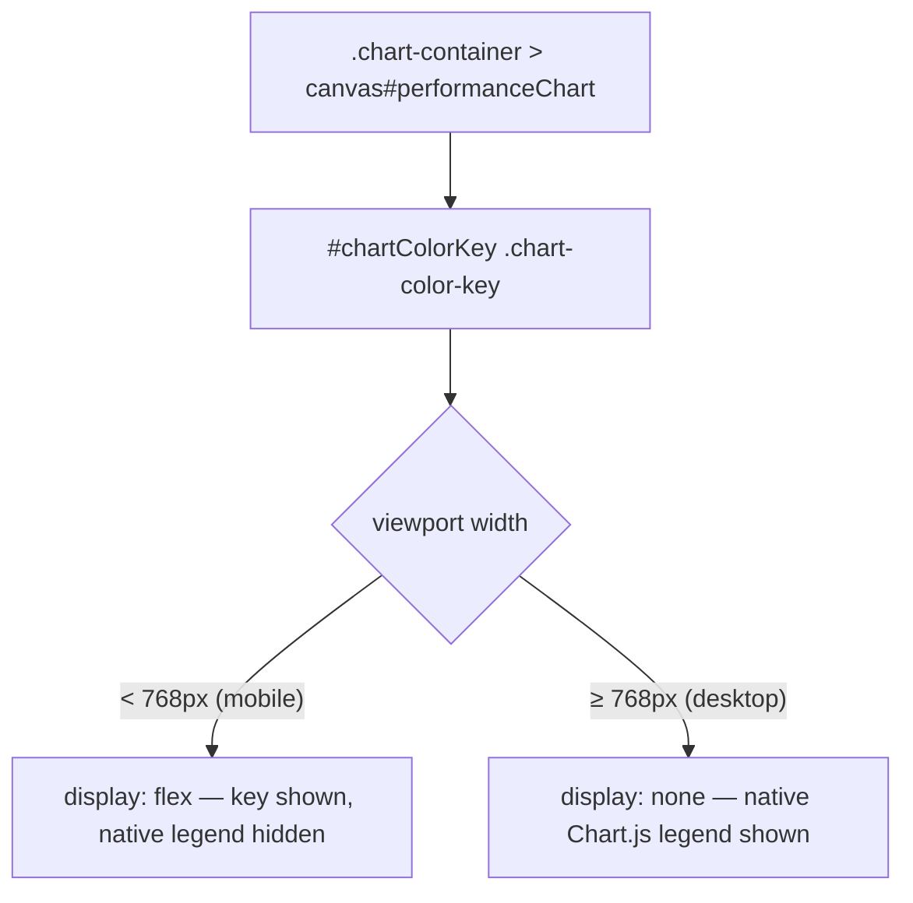

# Add mobile colour-key container + styles below the performance chart

## Summary

On mobile the Chart.js legend is force-hidden in `docs/app.js`, so no plotted
line can be identified on a phone. This PR adds the static, **mobile-only**
scaffold for a compact colour key that sits directly below the performance
chart. It delivers the container and styling only — a later issue (#236
milestone) populates the chips from the live chart datasets.

Changes:

- `docs/index.html` — added an empty `#chartColorKey` container as the
  immediate sibling directly below the `.chart-container` holding the chart
  canvas, with `class="chart-color-key"` and an `aria-label`.
- `docs/styles.css` — added `.chart-color-key` (a compact, wrapping flex row of
  chips, each a `.chart-color-key-swatch` colour block + `.chart-color-key-label`
  series label). The key is `display: none` on desktop (the native Chart.js
  legend is kept) and revealed with `display: flex` inside the existing
  `@media (max-width: 768px)` block — the same width boundary `isMobileDevice()`
  uses (Bootstrap `sm` and below, window width < 768px). An empty container
  renders nothing visible.

Out of scope (left untouched): populating entries, and the desktop Chart.js
legend rules.

Closes #243.

## Evidence

The committed container is empty, so to demonstrate the layout these
screenshots use a throwaway preview harness that reuses the real
`docs/styles.css` with five sample chips (the harness was not committed).

Mobile (~360px) — chips wrap compactly into rows below the chart, each a colour
swatch + label:

Desktop (~1200px) — the key is hidden (`display: none`); the native Chart.js
legend continues to identify the lines:

## Test Plan

Added `tests/chart_color_key_test.ts` (8 Deno tests, all behavioural assertions
against the shipped `docs/` files):

- `#chartColorKey` exists with the `chart-color-key` class and an `aria-label`.
- The container is empty (scaffold only).
- The key is the immediate sibling directly below the chart canvas/container.
- `.chart-color-key` is `display: none` by default (desktop keeps the legend).
- The `(max-width: 768px)` media block reveals it with `display: flex`.
- The base layout wraps its chips (`flex-wrap: wrap`).
- `.chart-color-key-swatch` / `.chart-color-key-chip` hooks are styled for the
  populate step.
- The existing `.chartjs-legend` rules are left intact (desktop unchanged).

Full `./quality.sh` passes (Rust fmt/clippy/check/test + coverage + build, and
Deno fmt/lint/check/test — 431 Deno tests pass).
