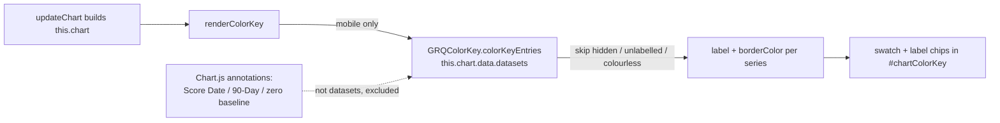

# Populate the mobile colour key from the live chart datasets (Issue #244)

## Summary

On mobile the native Chart.js legend is force-hidden, so no plotted line could
be identified on a phone. This change populates the mobile colour key
(`#chartColorKey`, scaffolded in #243) directly from the **live** Chart.js
dataset list, so the key always matches what is actually drawn — in both the
single-stock and aggregate views. Part of milestone #236. **Closes #244.**

What changed:

- **`docs/color_key.js`** (new) — a classic `<script>` (mirrors `escape.js` /
  `projection.js`) publishing `globalThis.GRQColorKey`. Its pure
  `colorKeyEntries(datasets)` helper returns one `{ label, colour }` per
  **visible, labelled** data series, reading each dataset's own `label` and
  `borderColor` — the live datasets are the single source of truth, with **no
  duplicated/hard-coded colour table**. It excludes:
  - hidden series (`hidden: true`),
  - layout-only "spacer" series with an empty/absent `label`,
  - series with no usable `borderColor`.

  Chart.js **annotation** lines (the Score Date / 90-Day Target markers and the
  zero baseline) are annotations, not datasets, so they never reach the helper
  and never appear as entries.

- **`docs/app.js`** — new `renderColorKey()` method, called from `updateChart()`
  after the chart is created. On **mobile only** it clears `#chartColorKey` and
  renders a swatch + label chip per entry. Labels use `textContent` (not
  `innerHTML`), keeping untrusted dataset labels (e.g. stock tickers) inert
  against DOM XSS. Desktop is unchanged — it returns early and keeps the native
  legend.

- **`docs/index.html`** — loads `color_key.js` before `app.js`.
- **`docs/sw.js`** — adds `color_key.js` to the precache list; dashboard version
  bumped **1.0.187 → 1.0.188** (`index.html` meta, `sw-register.js`, `sw.js`).

### Data flow

## Evidence

Captured at a 390×844 mobile viewport against the live dashboard. Each swatch
colour matches its plotted line; the vertical annotation markers and zero
baseline do **not** appear as entries.

**Aggregate view** — Performance, Target, Cost of Capital, SP500, NASDAQ,
Russell 2000:

**Single-stock view** — the same key driven off that view's datasets, including
the per-stock projection series (Projection (Trend Line), Hybrid Projection,
Hybrid 90-Day Point):

## Test Plan

- **`tests/chart_color_key_render_test.ts`** (new) — exercises the real shipped
  `colorKeyEntries` logic:
  - one entry per series, in dataset order, using each dataset's own
    label + colour (core, benchmark, and aggregate per-stock projection series);
  - hidden series excluded;
  - empty / whitespace-only / absent-label spacer series excluded;
  - labelled series with no usable colour skipped;
  - array `borderColor` collapses to its first colour;
  - non-array / empty / malformed input yields no entries (no throw);
  - `normaliseSwatchColour` trims strings, collapses arrays, rejects the rest.
- **`tests/js_syntax_test.ts`** — added a parse-cleanly assertion for
  `docs/color_key.js`.
- Full suite green: `deno test --allow-read tests/*.ts` → **442 passed**.
  `deno lint` / `deno check` clean; `cargo fmt --check` and `cargo clippy
  -D warnings` clean (no Rust changed).
