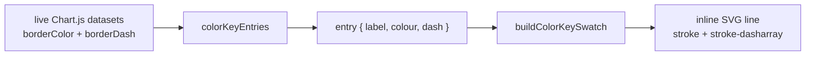

# Reflect each line's dashed/dotted style in its colour-key swatch

## Summary

The mobile colour key (issue #244) drew every swatch as a plain filled colour
block, so two series sharing a colour family — `Performance (After 90 Days)` and
`Cost of Capital`, both grey `rgba(108,117,125,*)` — looked identical apart from
their label. This change makes each swatch faithful to the line's stroke: it is
now a tiny inline SVG line drawn in the dataset's own colour **and** dash
pattern, so a dashed/dotted series shows a dashed/dotted swatch and a solid
series shows a solid one. Both the colour and the dash come straight from the
live dataset (`borderColor` / `borderDash`) — there is no hard-coded per-series
style table. Closes #245.

Changes:

- `docs/color_key.js` — added `normaliseSwatchDash(borderDash)`, which cleans a
  Chart.js `borderDash` into an array of finite, positive pixel lengths (`[]` =
  solid). `colorKeyEntries()` now returns `{ label, colour, dash }`, with `dash`
  sourced from each dataset's own `borderDash`. Helper published on
  `globalThis.GRQColorKey`.
- `docs/app.js` — `renderColorKey()` now builds each swatch via the new
  `buildColorKeySwatch(entry)`, which draws an inline SVG `<line>` using the
  entry's colour, `stroke-width: 2`, and `stroke-dasharray` from `entry.dash`
  (round caps so small `[2, 2]`-style patterns read as dots, matching Chart.js).
- `docs/styles.css` — `.chart-color-key-swatch` restyled from a filled block to
  size the inline SVG line (18×12).

Desktop is untouched: it keeps the native Chart.js legend, and the key only
renders on mobile.

## Evidence

Rendered the real `docs/color_key.js` entry builder plus the real swatch CSS and
the verbatim `buildColorKeySwatch()` for the live series set (the two greys, the
two dashed series, and solid benchmarks). The dashed series (`Performance (After
90 Days)` `[5, 5]`, `Projection (Trend Line)` `[8, 4]`) show dashed swatches;
the solid series (`Cost of Capital`, `Performance`, `Target`, `SP500`) show
solid swatches. The two greys are now distinguishable by stroke, not just label.

> Note: Playwright MCP was unavailable in this run; the screenshot was captured
> with headless Google Chrome against a page that loads the shipped
> `docs/color_key.js` and `docs/styles.css`.

## Test Plan

`tests/chart_color_key_render_test.ts` (run via `deno test --allow-read`):

- Updated existing exact-equality assertions to include `dash: []` for solid
  series — a deliberate, documented business-logic change (entries gained a
  `dash` field), not a removed test.
- Added `colorKeyEntries - carries each dataset's own borderDash so
  dashed/dotted series are distinguishable (issue #245)` — verifies the two
  greys differ (`[5, 5]` dashed vs `[]` solid) and `[8, 4]` flows through.
- Added `colorKeyEntries - absent or empty borderDash yields a solid (empty)
  dash`.
- Added `normaliseSwatchDash - keeps valid dash arrays, treats everything else
  as solid` — covers real patterns, non-array input, and junk-element filtering.
- Added `normaliseSwatchDash` to the published-helper assertion.

All 13 tests in the file pass, and `./quality.sh` passes cleanly.
