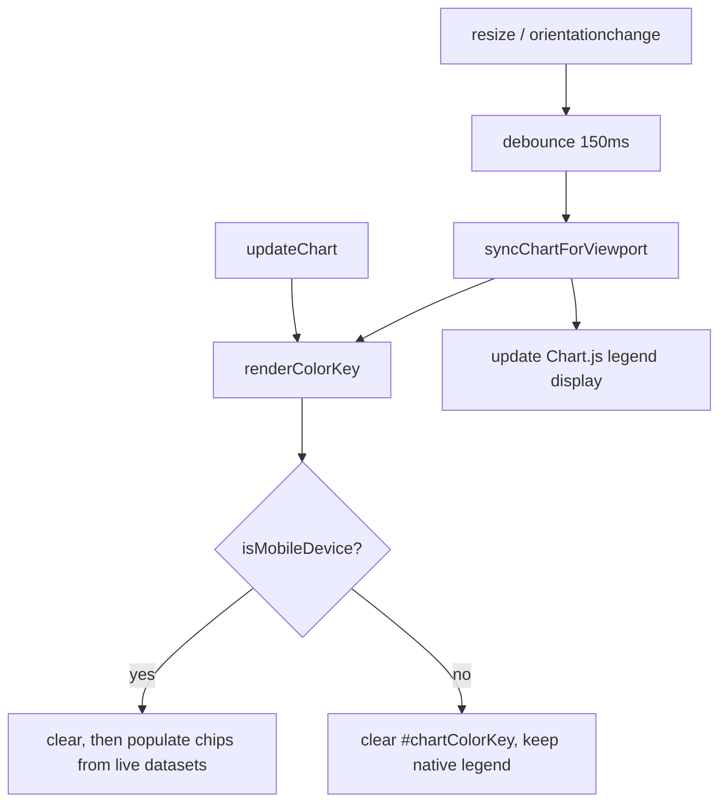

## Summary

Keep the mobile colour key (`#chartColorKey`) in sync as the chart's data and
the viewport change. Builds on the core colour-key render (#244) and the
swatch-style fidelity work (#245), part of the legend milestone #236.
**Closes #246.**

Two of the three required behaviours were already in place from #244 and only
needed to be confirmed; the third (viewport changes) was the real gap:

- **Data / view changes — already covered, confirmed.** `updateChart()`
  (`docs/app.js`) ends by calling `this.renderColorKey()`, so selecting a
  different stock or toggling single-stock vs aggregate view re-renders the key
  from the new live dataset list every time.
- **Desktop teardown — already covered, confirmed.** `renderColorKey()` clears
  `#chartColorKey` first and returns early when `!isMobileDevice()`, so no stale
  chips survive on desktop and the native Chart.js legend stays the identifier.
  This reconciles cleanly with the existing force-hide-legend block rather than
  duplicating it.
- **Viewport changes — new in this PR.** The window `resize` handler previously
  only re-evaluated the Chart.js legend; it never touched the colour key and was
  not debounced. It is now a single **debounced** `syncChartForViewport()` that
  updates the legend *and* calls `renderColorKey()`, so crossing the
  `isMobileDevice()` breakpoint shows+populates the key on mobile and tears it
  down on desktop. The same debounced handler is also bound to
  `orientationchange` (phone rotation). `renderColorKey()` guards a null/unbuilt
  chart itself, so the handler is safe before the first chart exists — no
  console errors.

A reusable `debounce(fn, wait)` helper was added to `docs/color_key.js` and
published on `globalThis.GRQColorKey`, mirroring how the pure entry-builder is
shared between the browser and the Deno tests. The browser handler is a thin
wrapper around this shipped helper, so the tests exercise the real logic.

The service-worker `APP_VERSION` was bumped **1.0.188 → 1.0.189**
(`index.html` meta, `sw-register.js`, `sw.js`) so clients pick up the updated
`app.js` / `color_key.js`.

### When render / teardown runs

## Evidence

**Playwright MCP was unavailable in this run**, so no live screenshot could be
captured. The change is verified by deterministic unit tests instead.

The genuinely new logic — the debounce that gates how often the key toggles on
a burst of resize events — is covered by `tests/chart_color_key_sync_test.ts`
using `@std/testing`'s `FakeTime` for deterministic, fast assertions (no real
sleeps). It proves a burst collapses into one trailing run, the timer restarts
on each fresh call, the latest args and `this` are forwarded, settled bursts
each run once, and independent wrappers keep separate timers.

The colour-key *contents* decision (which datasets become chips, in which view)
remains covered by the existing `tests/chart_color_key_render_test.ts`, which
drives the same `GRQColorKey.colorKeyEntries()` that `renderColorKey()` uses —
so "the key matches the lines then drawn" stays under test.

Manual reasoning for the acceptance criteria:

- Selecting a stock / switching aggregate ↔ single-stock → `updateChart()` →
  `renderColorKey()` rebuilds the chips from the new dataset list.
- Rotating / resizing across the breakpoint → debounced `syncChartForViewport()`
  → `renderColorKey()` shows the populated key on mobile and clears it on
  desktop, with no stale entries.
- Desktop → key cleared and hidden; Chart.js legend still identifies the lines.
- `this.chart` null/unbuilt → `renderColorKey()` returns early after clearing,
  so no console errors.

Full Deno suite: `deno test --allow-read tests/*.ts` → **453 passed, 0 failed**.

## Test Plan

- **Added** `tests/chart_color_key_sync_test.ts` — 8 tests for the new
  `GRQColorKey.debounce` helper (burst collapse, wait boundary, timer restart,
  latest-args + `this` forwarding, settled-burst re-run, independent timers).
- **Unchanged / still passing** `tests/chart_color_key_render_test.ts` and
  `tests/chart_color_key_test.ts` — confirm the key contents and the
  scaffold/styling are not regressed.
- `tests/js_syntax_test.ts` — confirms `docs/app.js` still parses cleanly after
  the resize-handler rewrite.
- No existing tests were removed or commented out.
