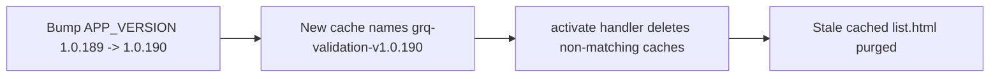

# Retire `list.*` from the PWA service-worker precache + bump cache version

## Summary
The `list.*` pages were retired from the dashboard, but the PWA service worker
(`docs/sw.js`) still precached them and its comments still named `list.html`.
This change removes the dead precache entries and bumps the aligned app/cache
version so existing visitors drop any stale cached `list.html`.

- `docs/sw.js` — dropped `./list.html`, `./list.js`, `./list_render.js`,
  `./list_stats.js`, `./list.css` from `STATIC_ASSETS`; updated the two
  comments that named `list.html`.
- Bumped the aligned version **1.0.189 → 1.0.190** across `docs/sw.js`
  (`APP_VERSION`, drives the cache names), `docs/sw-register.js`
  (`./sw.js?v=`, forces a fresh `sw.js` fetch) and `docs/index.html`
  (`app-version` meta + `sw-register.js?v=` script tag).
- Fixed the `docs/sw-register.js` header comment that named `list.html`.

The cache version was already `1.0.189` on the milestone branch (the issue
referenced `1.0.187`), so the bump moves the three files together to the next
patch, `1.0.190`.

Closes #253

## Evidence
Backend/PWA config change — no web UI to screenshot. Verified via Deno tests.



Test run:

```
running 4 tests from ./tests/sw_precache_list_test.ts
sw.js STATIC_ASSETS no longer precaches any list.* file ... ok
sw.js contains no remaining list.html reference (comments included) ... ok
sw-register.js contains no remaining list.html reference ... ok
app/cache version is aligned across sw.js, sw-register.js and index.html ... ok
running 4 tests from ./tests/sw_pathname_guards_test.ts
... ok | 8 passed | 0 failed
```

## Test Plan
- Added `tests/sw_precache_list_test.ts`:
  - `STATIC_ASSETS` no longer precaches any `list.*` file (reproduces the issue).
  - No remaining `list.html` reference in `docs/sw.js` (comments included).
  - No remaining `list.html` reference in `docs/sw-register.js`.
  - App/cache version aligned across `docs/sw.js`, `docs/sw-register.js`,
    `docs/index.html` (meta + script tag).
- `tests/sw_pathname_guards_test.ts` still passes — fetch-routing regexes unchanged.
- `./quality.sh` passes cleanly.
