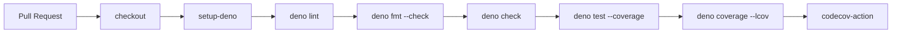

## Summary

Add the **Deno Quality** GitHub Actions workflow at `.github/workflows/deno-quality.yml`. The workflow runs `deno lint`, `deno fmt --check`, `deno check`, and `deno test` with LCOV coverage uploaded to Codecov on every pull request. All third-party actions are pinned to 40-character commit SHAs per the supply-chain rule. Closes #26.

The `deno check mod.ts` step from the issue template was adapted to `deno check tests/*.ts` because this repo has no `mod.ts`; the project's `deno.json` scopes Deno operations to `tests/**/*`, matching `quality.sh`.

## Evidence

CLI change — no UI to screenshot. Verified by:

- Running `deno test --allow-read tests/deno_quality_workflow_test.ts` — all 6 tests pass.
- Running `deno lint`, `deno fmt --check`, and `deno check` on the new test file — clean.

## Test Plan

- Added `tests/deno_quality_workflow_test.ts` covering:
  - workflow file exists and parses as YAML
  - `name` is `Deno Quality`
  - `pull_request` trigger present
  - top-level `contents: read` permission
  - `quality` job runs `deno lint`, `deno fmt --check`, `deno check`, `deno test ... --coverage`, and `deno coverage ... --lcov`
  - job uses `actions/checkout`, `denoland/setup-deno`, `codecov/codecov-action`
  - every `uses:` is pinned to a 40-char commit SHA (supply-chain rule)
