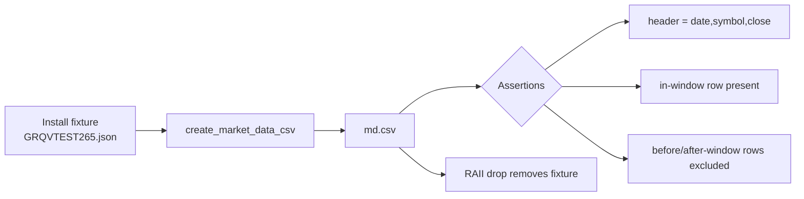

## Summary

Closes #265.

`create_market_data_csv` (`src/utils.rs:406`) and its thin wrapper
`create_market_data_csv_for_score_file` (`src/utils.rs:391`) were the only
market-data writers with **no** test exercising them, directly or indirectly —
an asymmetric gap, since the long-format variant
(`create_market_data_long_csv_for_score_file`) is already covered by
`tests/market_data_tests.rs`. A refactor of the date-windowing or CSV-writing
logic could silently change the produced file with nothing to catch it.

This PR adds `tests/create_market_data_csv_test.rs` with two WHAT-tests that pin
the public contract — the `date,symbol,close` header and the inclusive 180-day
window filter — without asserting how the function computes them. No production
code changed; this is a pure coverage addition.

### Hermetic, not environment-dependent

The existing market-data tests **skip** when the external
`MARKET_DATA_BASE_PATH` repository is absent, so they provide no safety net in
CI. To always run and stay deterministic, each new test installs a small,
fully controlled market-data fixture at the exact location the function reads
from, then removes exactly what it created on drop (via an RAII guard) — leaving
no trace whether or not the external data repository pre-exists. The fixture
uses a clearly-synthetic symbol (`GRQVTEST265`) so it can never collide with a
real symbol.

## Evidence

Backend/CLI change with no web interface — no screenshot applicable. Verified
via the test suite:

- `cargo test --test create_market_data_csv_test` → `2 passed; 0 failed`.
- Full suite `cargo test --all-targets --all-features` → all green (lib 50
  passed, integration targets all passed).
- `./quality.sh` completes with `✅ Quality checks completed successfully!`
  (fmt, clippy `-D warnings`, type checks, tests, coverage, Deno checks).

The fixture leaves no residue: `../GRQ-shareprices2026Q2` does not exist after
the run when it was absent beforehand.

## Test Plan

Added `tests/create_market_data_csv_test.rs`:

- `create_market_data_csv_writes_windowed_rows` — asserts the `date,symbol,close`
  header, that the window-start row (`2025-04-15`) is present with its close
  price, and that rows before (`2024-01-01`) and after (`2025-12-01`) the
  180-day window are excluded.
- `create_market_data_csv_for_score_file_writes_derived_csv` — asserts the
  wrapper writes the CSV at the derived `<stem>.csv` path with the same header
  and in-window row.

A regression in the window filter (leaking out-of-window rows) or the header
contract would now fail these assertions.
