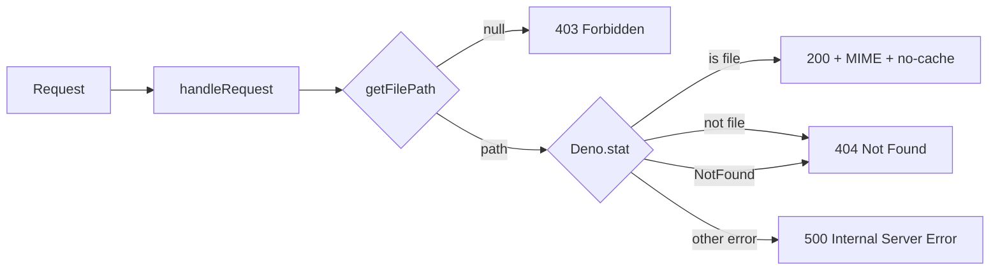

## Summary

Added behaviour tests for the previously untested exported `handleRequest` in
`helpers/server.ts`. The function carries logic beyond the already-tested path
containment (`getFilePath`): MIME-type mapping, 200/403/404/500 status
selection, and cache-control headers. None of it was exercised by any test, so
a refactor could silently break it. `handleRequest` is live code — it backs
`Deno.serve` in the test server — so the function is kept and tested rather than
deleted. Closes #267.

## Evidence

Backend/CLI change — no web interface to screenshot. Verified via the Deno test
suite: the 6 new tests pass and the full suite stays green (582 passed).

```
ok | 6 passed | 0 failed (11ms)   # new file
ok | 582 passed (55 steps) | 0 failed (2s)  # full tests/*.ts
```

The new tests are WHAT-tests: each passes a `Request` and asserts on the
observable `Response` (status, headers, body), never on internal calls, so they
survive refactors of the handler's internals.

A design note worth recording: an *encoded* `../` sequence
(`/%2e%2e/%2e%2e/etc/passwd`) does **not** reach the 403 branch through
`handleRequest`, because the WHATWG `URL` parser collapses those dot-segments
before `getFilePath` sees them. The realistic 403 trigger at the HTTP layer is a
malformed percent-escape (a lone `%`), which `getFilePath` rejects. The encoded
traversal rejection remains pinned directly on `getFilePath` by
`tests/server_path_traversal_test.ts`.



## Test Plan

Added `tests/server_handle_request_test.ts` covering `handleRequest`:

- serves `index.html` with 200 and `text/html` content-type (happy path)
- maps `.json` files to `application/json` (MIME mapping)
- sets `no-cache, no-store, must-revalidate` cache-control on served files
- returns 404 for a missing file (error path)
- returns 404 for a directory path (not-a-file edge case)
- returns 403 for a malformed percent-escape (security/error path)

Existing `tests/server_path_traversal_test.ts` is unchanged and still passes.
