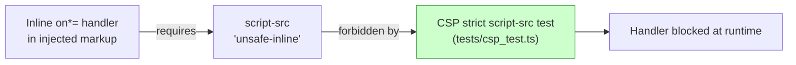

## Summary

Removed the redundant source-text grep test `docs/app.js: generated rows use no inline event handlers` from `tests/csp_test.ts`. Closes #268.

The deleted test read the source of `docs/app.js` and regex-matched it for a
hard-coded subset of inline `on*=` event-handler spellings
(`onclick|onchange|onerror|onload|oninput`). This was a static source-text proxy
for a security property, not a behaviour assertion. It had two concrete flaws
the issue called out:

- **False positives** — it could match a benign string literal that happens to
  contain `on… =`.
- **Silent gaps** — it missed any handler attribute spelled outside its fixed
  list (e.g. `onmouseover`, `onfocus`).

Either way it reported on *how the source is written*, not on behaviour a caller
can observe.

### Why deletion (the issue's Option 1) rather than a DOM rewrite (Option 2)

The *observable* contract — that inline `on*=` handlers never execute — is
already enforced at runtime by the Content-Security-Policy and pinned by the
same file's `script-src is strict (no unsafe-inline/eval)` test. An inline event
handler requires `script-src 'unsafe-inline'` to run, which that test forbids on
every page in `PAGES` (including `docs/index.html`, which loads
`docs/app.js`). The grep was therefore redundant defence-in-depth.

A DOM behaviour rewrite that renders rows through the app's real code path was
considered but is not feasible in scope: `docs/app.js` (4242 lines) executes
side-effects at import (`const validator = new GRQValidator();`), so it cannot
be loaded into a Deno test without a full DOM/`fetch`/Chart/bootstrap stub — the
reason the project deliberately extracts testable logic into separate modules
(`escape.js`, `color_key.js`, `projection.js`) and never imports `app.js`.
Adding an external DOM-parser dependency purely for a `severity:low` test-audit
cleanup would be disproportionate and is quarantine-gated. The deletion is
documented with an in-place comment in `tests/csp_test.ts` pointing to the CSP
test that supersedes it.

## Evidence

Backend/test-only change — no web UI to screenshot. Verified via the test suite:

- `deno test --allow-read tests/csp_test.ts` → `9 passed | 0 failed` (the
  removed grep test is gone; the CSP strict-policy tests that enforce the real
  contract remain green).
- Full suite `deno test --allow-read tests/*.ts` → `587 passed | 0 failed`.
- `deno fmt`, `deno lint`, and `deno check` on `tests/csp_test.ts` all pass.

## Test Plan

- **Removed** `tests/csp_test.ts::"docs/app.js: generated rows use no inline event handlers"`
  (the source-text grep), replaced with an in-place documentation comment
  explaining the rationale and the CSP test that covers the same property.
- **Retained** the runtime guard that enforces the observable contract:
  `tests/csp_test.ts::"docs/index.html: script-src is strict (no unsafe-inline/eval)"`,
  which blocks inline `on*=` handlers from executing on the page that loads
  `docs/app.js`.
- Confirmed no other test or source file references the removed test name.
