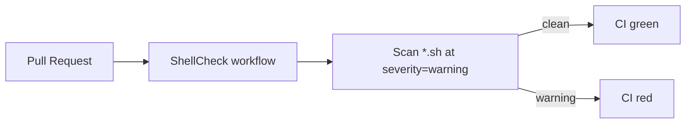

## Summary

Added a ShellCheck Lint GitHub Actions workflow at `.github/workflows/shellcheck.yml`
that runs on pull requests and pushes to `main`/`master`. The workflow scans every
shell script in the repository at `warning` severity using
[`ludeeus/action-shellcheck`](https://github.com/ludeeus/action-shellcheck).

Both third-party actions are pinned to commit SHAs (not version tags) per the
supply-chain guidelines.

Also removed two unused variables (`SCRIPT_NAME`, `MAX_STALE_SECONDS`) from
`run.sh` that triggered `SC2034` warnings — without this fix the new lint
workflow would fail on first run.

Closes #27.

## Evidence

This change is a backend/CI addition with no web interface. Validation performed:

- `python3 -c "import yaml; yaml.safe_load(open('.github/workflows/shellcheck.yml'))"` &rarr; YAML parses.
- `bash -n run.sh` &rarr; bash syntax OK after the cleanup.
- `find . -name "*.sh" -not -path "./.git/*" -not -path "./target/*" | xargs shellcheck --severity=warning` &rarr; exit `0`, no findings across all six shell scripts (`process_date.sh`, `setup-hooks.sh`, `quality.sh`, `run.sh`, `run_annualized_tests.sh`, `helpers/server.sh`).

## Test Plan

- [x] Local ShellCheck pass on all six `*.sh` scripts at `severity=warning`.
- [x] YAML syntax validated with `yaml.safe_load`.
- [x] Bash syntax for the edited `run.sh` validated with `bash -n`.
- [ ] First CI run on the PR exercises the new workflow end-to-end on GitHub-hosted runners.
