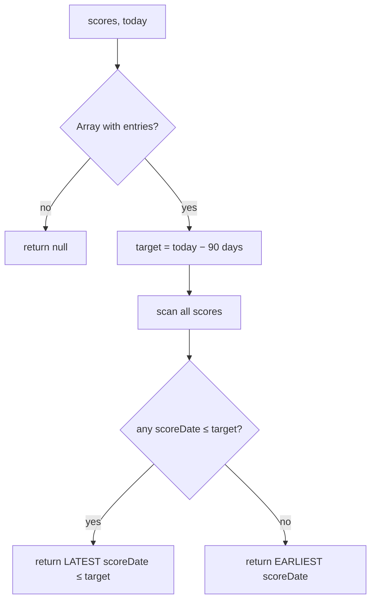

# Default date selection lands on or before 90 days ago

## Summary

The dashboard's default score-file auto-selection used an absolute-nearest
(`Math.abs`) comparison against `today − 90 days`, so a score date a few days
*more recent* than the 90-day target (e.g. 87 days ago) could wrongly win over
the correct earlier date (e.g. 90/93 days ago).

This replaces that logic with "select the **latest** score date that is on or
before `today − 90 days`", falling back to the **earliest** available date only
when no score date is on/before the target. The selection is extracted into a
pure, unit-tested helper `GRQProjection.selectDefaultScore(scores, today)` in
`docs/projection.js` (mirroring the existing shared-module pattern), so the
browser dashboard and the Deno tests exercise the exact same code without a
browser.

The helper parses `YYYY-MM-DD` score dates as **local** midnight (not UTC
midnight, which `new Date(str)` would do) so the "on or before" calendar
comparison is not skewed by a day in some timezones.

`docs/app.js` now delegates to the helper; its `change` handler remains attached
via `addEventListener` (no inline `on*` handlers reintroduced — see #268).

Closes #275.

## Evidence

Default auto-selection on the live dashboard (system date 2026-06-22, target
2026-03-24). The dropdown defaults to **2026-03-24 (March 24)** — exactly 90
days ago, on/before the target — and the console logs
`Auto-selecting score file on or before 90 days ago: 2026-03-24 (March 24)`.

### Selection logic

## Test Plan

Added `tests/score_selection_test.ts` (TDD — written failing first against the
absent helper, then made to pass). It imports the real shipped helper from
`docs/projection.js` and asserts on its output:

- **Regression #275**: 87-days-ago (closer, but more recent than target) vs
  93-days-ago — the 93-days-ago date is chosen, reproducing and fixing the bug.
- Exact 90-days-ago date is chosen when present.
- Chooses the **latest** date on or before the target among several older dates.
- Falls back to the **earliest** date when every score is more recent than the
  target.
- Order-independent fallback (ignores array order).
- Empty list and non-array input return `null`.
- Single old date is chosen.

All 9 new tests pass; the full Deno suite (440 tests) and `./quality.sh` pass
cleanly.
