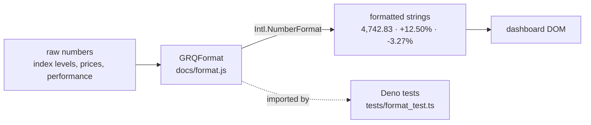

# Format dashboard numbers with thousands separators and consistent decimals

## Summary

Dashboard figures were rendered with bare `toFixed()`/`Math.round()`, so large
values such as index levels (`16057.44`) displayed without thousands separators
and with inconsistent decimal places. This adds a **pure** number-formatting
module, `docs/format.js`, that wraps `Intl.NumberFormat`, and routes the
displayed numeric values through it. The new module mirrors the existing
pure-module pattern (`docs/escape.js`, `docs/projection.js`,
`docs/color_key.js`): it is a classic `<script>` with no module syntax that
publishes its helpers on `globalThis.GRQFormat`, so the browser dashboard and
the Deno tests exercise the exact same code.

Closes #276. Part of #269 (item B).

### What changed

- **`docs/format.js`** (new) — pure helpers:
  - `formatNumber(value, decimals = 2)` — thousands separators + fixed decimals
    (e.g. `4742.83 → "4,742.83"`, `5 → "5.00"`); returns `"N/A"` for non-finite
    input; accepts numeric strings.
  - `formatIndexLevel(value, decimals = 2)` — market index levels.
  - `formatPercent(value, decimals = 2)` — explicit sign + trailing `%`
    (e.g. `12.5 → "+12.50%"`, `-3.27 → "-3.27%"`).
  - `toFiniteNumber(value)` — defensive numeric coercion.
- **`docs/app.js`** — added `formatIndexLevel`/`formatPercent` wrappers that
  delegate to the shared module, and routed the SP500/NASDAQ/Russell 2000 index
  **levels** and **performance %** through them. The stock **current price**
  (`getCurrentPrice`) now uses the shared currency formatter so large prices
  carry separators. Stock prices/targets already used `formatCurrency`
  (`Intl.NumberFormat`), so they keep their separators; the percent sign and
  any currency symbol are preserved throughout.
- **`docs/index.html`** / **`docs/sw.js`** — load and precache `format.js`
  (before `app.js`); bumped `APP_VERSION` `1.0.190 → 1.0.191` across `sw.js`,
  `sw-register.js` and `index.html` so the new asset is re-fetched.

### Data flow

## Evidence

Market Performance Comparison — index levels now show thousands separators
(`6,556.37 → 7,500.58`, `21,761.89 → 26,517.93`) and signed percentages:

Aggregate stock table (prices/targets via the shared currency formatter, signs retained):

Full dashboard:

Screenshots were captured against a local file-server using a headless Chromium
(the Playwright MCP browser was not available in this environment).

## Test Plan

- **`tests/format_test.ts`** (new, TDD — written failing first): covers
  thousands separators (`4742.83 → "4,742.83"`), consistent decimals
  (`5 → "5.00"`), custom decimals, negative values, numeric strings, `"N/A"`
  for non-finite input, `formatIndexLevel`, `formatPercent` sign handling
  (`+`/`-`, zero, large grouped percentages), and `toFiniteNumber`.
- **`tests/js_syntax_test.ts`**: added a parse-clean check for
  `docs/format.js`.
- Full Deno suite: `deno test --allow-read tests/*.ts` — 453 passed
  (including the SW precache version-alignment guard after the version bump).
