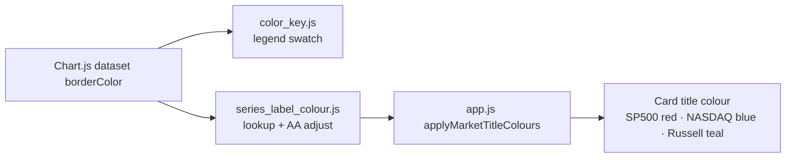

# Match each market series' title/label colour to its chart line colour

## Summary

The market index card headers used hard-coded Bootstrap text colour classes
(`text-primary`, `text-info`, `text-success`) that were unrelated to the chart
line each series is drawn with — e.g. the SP500 line is red but the "SP500
Performance" title was blue. This drives each title's colour from the **same
single source of truth** the colour key already reads: the Chart.js dataset's
own `borderColor`. So the title always agrees with the line in both the
aggregate and single-stock views. Closes #278.

A new pure module `docs/series_label_colour.js` (mirroring the
`docs/color_key.js` pattern — classic script, helpers on `globalThis`, shared by
the browser and the Deno tests) owns the colour-pairing logic:

- `lookupSeriesColour(datasets, label)` pairs a title label with its own line
  colour from the live datasets (no duplicated colour table).
- `accessibleColour(colour, theme)` keeps the line's hue but nudges its
  lightness until it clears **WCAG 2 AA** contrast (≥ 4.5:1) against the card
  background — darkening for the light theme, lightening for the dark theme — so
  the title stays readable in both themes.

`docs/app.js` is a thin DOM wrapper: after each chart build it reads the live
datasets and paints `#sp500Title` / `#nasdaqTitle` / `#russell2000Title`, and
re-applies on a theme switch (handlers attached via `addEventListener`, no
inline `on*` handlers — issue #268).

### Data flow

### Deno regression avoided

- Generated PR screenshot evidence by driving the cached Chromium over CDP from
  a throwaway Deno script, rather than introducing Playwright/Node tooling into
  this Deno repo.

## Evidence

Title colours now match the legend line swatches in both themes (derived from
the dataset `borderColor`): SP500 red, NASDAQ blue, Russell 2000 teal. Computed
title colours read back from the live page:

- Light: `rgb(198, 77, 102)` / `rgb(41, 122, 176)` / `rgb(51, 130, 130)` —
  4.51 / 4.66 / 4.51 : 1 against white (all ≥ AA 4.5:1).
- Dark: `rgb(255, 99, 132)` / `rgb(54, 162, 235)` / `rgb(75, 192, 192)` —
  4.99 / 5.10 / 6.51 : 1 against the dark card (all ≥ AA 4.5:1).

## Test Plan

TDD — failing tests written first in
`tests/series_label_colour_test.ts`, then the module implemented:

- `lookupSeriesColour` pairs each title label with its own line colour; trims
  and ignores case; returns `""` for unknown/invalid series.
- `accessibleColour` keeps the line hue (red stays red-dominant) and meets AA
  (≥ 4.5:1) against both the light and dark card backgrounds for all three
  benchmark colours.
- `seriesLabelColour` end-to-end: the SP500 title is an AA-compliant red in both
  themes, and returns `""` (no recolour) when the series is absent.
- `parseRgb` / `contrastRatio` cover rgba/rgb/hex parsing and the WCAG contrast
  bounds (21:1 white-on-black, 1:1 identical).
- `tests/js_syntax_test.ts` gains a parse check for the new
  `docs/series_label_colour.js`.

All 471 Deno tests pass (`deno test --allow-read tests/*.ts`).
