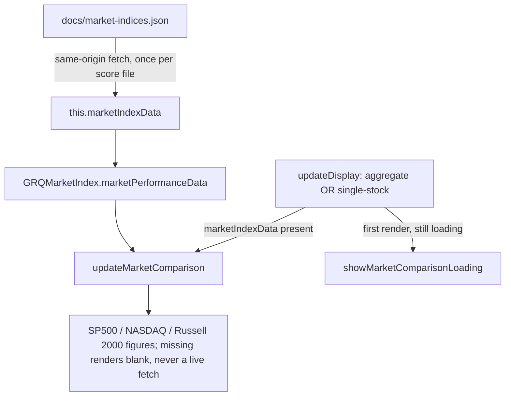

# Show benchmark index numbers on the single-stock view (issue #279)

## Summary

On the single-stock view (`.stock-detail-view`) the SP500 / NASDAQ / Russell
2000 benchmark **index numbers did not appear**. The data was already loaded
same-origin into `this.marketIndexData` (from `docs/market-indices.json`), but
`updateMarketComparison()` only ran once after the initial asynchronous load.
Switching to a stock calls `updateDisplay()`, which reset the figures to their
"Loading…" placeholder via `showMarketComparisonLoading()` and **never
repopulated them**, so the numbers stayed blank on the detail view.

The fix sources the figures **only** from the already-loaded local data — no
live/network fetch — and renders them on every view:

- Extracted the benchmark data path into a new shared pure module
  `docs/market_index.js` (`GRQMarketIndex`), the single source of truth used by
  both the browser dashboard and the Deno tests (mirrors `format.js` /
  `color_key.js`). `app.js`'s `calculateMarketPerformance()` and
  `getMarketPerformanceData()` now delegate to it.
- `updateDisplay()` now calls `updateMarketComparison()` when
  `this.marketIndexData` is present (every view, including the single-stock
  view), falling back to the loading state only on the very first render while
  the data is still loading asynchronously.
- `updateMarketComparison()` was rewritten data-driven over the three indices:
  a present index renders its percentage and `initial → current` levels; a
  **missing** index renders blank (`-`), never an error and never a fetch.

No live Yahoo fetch is introduced — the figures come solely from
`this.marketIndexData` (i.e. `docs/market-indices.json`). Handlers remain
`addEventListener`-based (no inline `on*`), and the new script is added to the
PWA precache list with the app version bumped to `1.0.193`.

Closes #279.



## Evidence

Verified in a real headless browser (Chrome via the DevTools Protocol) against
a static server serving `docs/`. After clicking a stock to enter the
single-stock view (`.stock-detail-view` applied), the benchmark numbers are
present and sourced from the local file:

```
AGGREGATE:    {"display":"block","sp500":"+14.40%","nasdaq":"+21.85%","russell":"+18.93%"}
SINGLE-STOCK: {"detailView":true,"display":"block","sp500":"+14.40%",
               "sp500Details":"6,556.37 → 7,500.58","nasdaq":"+21.85%","russell":"+18.93%"}
```


## Test Plan

- Added `tests/market_index_test.ts` covering the shipped extraction logic in
  `docs/market_index.js`:
  - `indexPerformance` computes the percent move and returns the initial/current
    levels; positive and negative moves.
  - `indexPerformance` returns `null` for missing prices (render blank, no error).
  - `marketPerformanceData` extracts all three indices from local data, **omits**
    an index whose prices are absent/unusable, and tolerates `null`/`undefined`
    input (empty object, never throws).
- Existing guards re-run green: `js_syntax_test.ts` (parses the updated
  `app.js`), `csp_test.ts` (no inline scripts / handlers), `sw_precache_list_test.ts`
  (version aligned across `sw.js` / `sw-register.js` / `index.html`).
- Full Deno suite: `deno test --allow-read tests/*.ts` → **478 passed, 0 failed**.
- `deno fmt`, `deno lint`, `deno check` all clean.
