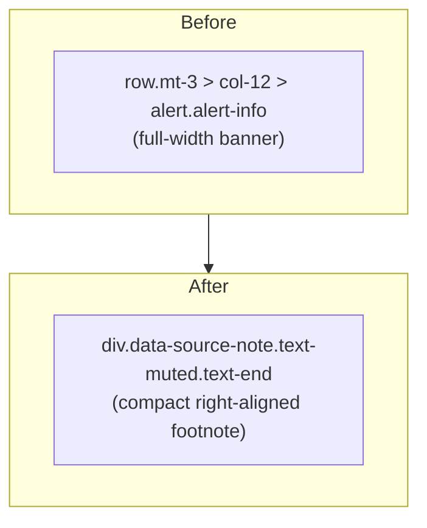

# PR Summary — Issue #280

## Summary

Compacted the Yahoo Finance data-source disclaimer so it stops consuming a
full-width banner's worth of vertical space. The attribution previously
rendered as a full-width `alert alert-info` block at
`docs/index.html`. It is now a compact, right-aligned muted footnote directly
under the Market Performance Comparison index cards. The wording is unchanged
(Yahoo Finance terms generally require source attribution), so the attribution
stays discoverable while reclaiming the banner's space.

Part of milestone #269 (item **H**). Closes #280.

### What changed

- `docs/index.html` — replaced the `.row.mt-3 > .col-12 > .alert.alert-info`
  banner wrapping the attribution with a single compact
  `div.data-source-note.text-muted.text-end.mt-2 > small` footnote. The info
  icon is marked `aria-hidden="true"` (decorative). No inline `on*` handlers
  were added (issue #268 constraint).
- `docs/styles.css` — added a small `.data-source-note` rule (`font-size: 0.8rem`)
  for the compact footnote. Colour is inherited from the existing theme-aware
  `.text-muted` rules, so contrast meets WCAG 2 AA in both themes:
  - Light: Bootstrap `#6c757d` on the white card ≥ 4.5:1.
  - Dark: `--grq-text-muted` (`#b6bcc4`) on the dark surface, via the existing
    `.dark-mode-forced .text-muted` / auto-dark rules.

### Layout before/after

## Evidence

Rendered locally (served `docs/` and screenshotted in headless Chrome). The
disclaimer now reads as a small right-aligned footnote beneath the index cards
rather than a full-width alert banner:

Dark-mode contrast is covered by the existing theme-aware `.text-muted` rules
(already AA-validated by `tests/theme_test.ts` and the a11y checks); the compact
note reuses those rules rather than introducing a new colour.

## Test Plan

Added `tests/data_source_disclaimer_test.ts` (TDD — written failing first, item
G of #269):

- `index.html: Yahoo Finance attribution is still present in the DOM` — the
  attribution text remains discoverable.
- `index.html: attribution is no longer a full-width alert banner` — the
  enclosing `
` no longer carries an `alert` class.
- `index.html: attribution uses the compact data-source-note` — the enclosing
  `
` carries the `data-source-note` class.
- `styles.css: compact note keeps a small footnote font-size` — the
  `.data-source-note` rule pins a small `font-size`.

All 482 Deno tests pass (`deno test --allow-read tests/*.ts`); `deno fmt
--check`, `deno lint`, and `deno check` are clean.
