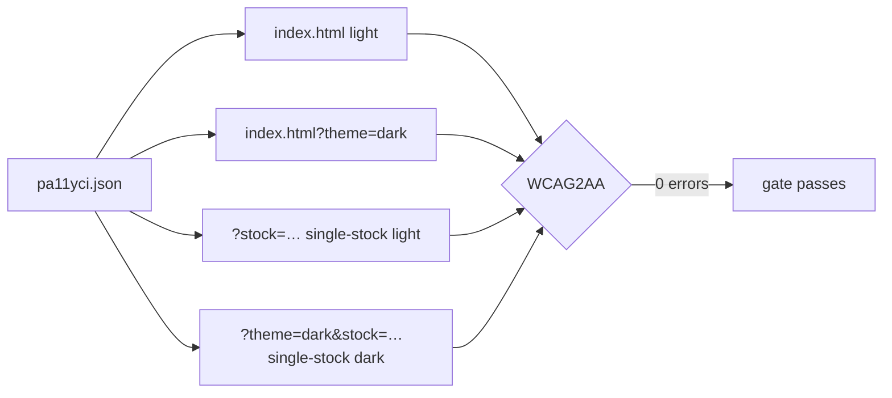

## Summary

Fixed the WCAG 2 AA dark-theme contrast failures across the dashboard and
extended the automated accessibility gate to actually catch them. Previously
`pa11yci.json` scanned only the aggregate page in the default (light) theme, so
contrast regressions in the **single-stock detail view** and in **dark mode**
went undetected. **Closes #281.**

Following the issue's TDD order (item G), the checks were strengthened first so
they failed on the current state, then every contrast/readability issue was
fixed until the gate passed.

### What changed

**Stronger a11y coverage (checks first)**
- `pa11yci.json` now audits **both views × both themes** as four distinct URLs
  (kept WCAG2AA): aggregate light, aggregate dark, single-stock light,
  single-stock dark. Running it against the unfixed CSS reproduced the failures
  (127 errors on the dark aggregate, plus single-stock failures in both themes).
- pa11y-ci stays **CI-only** — no `package.json`, no Node tooling added.
- New deep-link URL parameters make each view linkable and let pa11y target them
  deterministically:
  - `?theme=auto|light|dark` (transient override, never persisted) — `theme.js`.
  - `?stock=<symbol>` opens the single-stock detail view — `stock_selection.js`.

**Contrast/readability fixes (WCAG 2 AA in light *and* dark)**
- Introduced theme-aware semantic colour variables (`--grq-link/-good/-bad/`
  `-neutral`) and rewrote the component colour rules to use
  `var(--grq-*, <light-fallback>)`, so a single rule serves both themes and the
  dark theme brightens links, gains, losses and muted values to ≥ 4.5:1.
- **Item D** — the "Individual Stock Performance" table header (`.stock-table th`)
  is now dark-theme responsive (dark surface + light text instead of a light bar
  in a dark table).
- **Item E** — the dark-green/blue-on-black failures are gone:
  `getTargetPriceColor` now returns theme-aware CSS **class tokens**
  (`price-good/-bad/-neutral`) instead of hard-coded inline colours; the inline
  `#c00` error colour became `.price-error`; the per-value link blue, gain green
  and loss red all brighten in dark mode. The duplicate light-only
  `.performance-*` rules were removed from `index.html` so the theme-aware CSS
  governs.
- **Item i** — assorted dark-mode labels fixed: the portfolio totals row, the
  stock-notes box, the debug-info line, the "Back to Portfolio View" button, and
  the auto-`prefers-color-scheme: dark` block was brought to parity with the
  forced-dark rules so OS-dark users get the same readable surfaces.
- Values inside coloured badges (Judgement / Status) now inherit the badge's
  text colour rather than the link blue, fixing blue-on-green/yellow.

All four pa11y URLs report **0 errors** at WCAG2AA.

## Evidence

Dark-mode readability confirmed with a headless Chrome (Deno + `npm:puppeteer-core`,
no Node tooling added) on both views; pa11y-ci reports `4/4 URLs passed`.

Aggregate view (dark):

Single-stock detail view (dark):

## Test Plan

- `tests/pa11y_config_test.ts` (new) — asserts `pa11yci.json` enforces WCAG2AA
  and covers the aggregate page, the single-stock view, both themes, and the
  single-stock-in-dark combination. Fails against the previous single-URL config.
- `tests/stock_selection_test.ts` (new) — `stockFromSearch` /
  `resolveStockSelection` happy-path, unknown-symbol, blank and defensive cases.
- `tests/theme_test.ts` — added `preferenceFromSearch` cases (valid theme,
  absent, unrecognised, null/undefined).
- `tests/fair_value_color_test.ts` — updated for the documented business-logic
  change: `getTargetPriceColor` now returns class tokens
  (`price-bad`/`price-good`/`price-neutral`/`''`) instead of inline style
  strings; the red/green/grey decision tree is unchanged.
- Full suite: `deno test --allow-read tests/` → all pass; `cargo test` → all
  pass (Rust untouched); `deno fmt --check` / `deno lint` / `deno check` clean;
  `markdownlint-cli2` clean.

### Deno regression avoided

The dark-mode screenshots were captured with `npm:puppeteer-core` under Deno
(native `npm:` specifier, cached by Deno) driving the system Chrome — no
`package.json`, `node_modules` or Node bundler was introduced, and pa11y-ci
remains CI-only.
