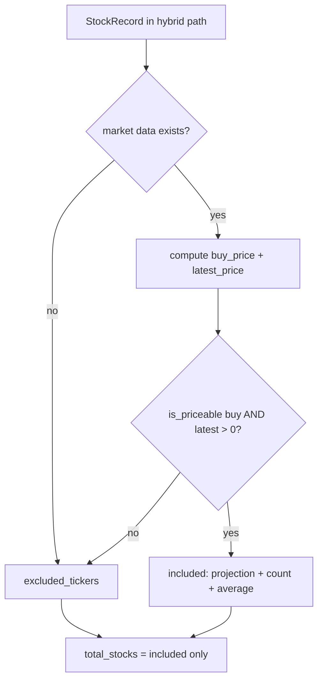

## Summary

Apply the unpriceable-stock exclusion rule to the hybrid projection path
(`src/utils.rs::calculate_hybrid_projection`) so recent (under-90-day) scores
and mature scores share identical exclusion semantics. Closes #287.

The shared `is_priceable(buy_price, current_price)` predicate, the
`excluded_tickers` surfacing, and the included-only count/average correction
were introduced for `calculate_portfolio_performance` and, in the same change
(#308), already wired into `calculate_hybrid_projection` — the hybrid path now
gates inclusion on `is_priceable(buy_price, latest_price)` (requiring BOTH a
usable buy price AND a usable current/latest price) rather than the old
`buy_price > 0.0`-only guard, pushes unpriceable tickers onto `excluded_tickers`,
and reports `total_stocks` over included stocks only.

This PR completes the issue's TDD requirement by adding the parallel exclusion
cases for the hybrid path, locking in that behaviour and guarding against
regression to a buy-price-only gate.

## Evidence

Backend/CLI change — no web interface to screenshot. Verified via the Rust unit
tests below and the full quality gate.

- `cargo test --lib hybrid_projection` → 11 passed, 0 failed (5 new cases plus
  the existing hybrid tests).
- `./quality.sh < /dev/null` → completes with "✅ Quality checks completed
  successfully!" (fmt, clippy `-D warnings`, `cargo check`, full `cargo test`,
  tarpaulin coverage, release build, and the Deno test/lint/check suite all
  green).

The `missing current/latest price → excluded` case is the key regression guard:
under the previous `buy_price > 0.0`-only gate a stock with a usable buy price
but no usable latest price would have been wrongly included; the new test
asserts it is excluded and surfaced in `excluded_tickers`.

## Test Plan

Added to the `src/utils.rs` test module:

- `test_hybrid_projection_includes_when_both_prices_present` — both prices usable → included, not excluded.
- `test_hybrid_projection_excludes_when_buy_price_missing` — buy price 0.0, latest usable → excluded.
- `test_hybrid_projection_excludes_when_latest_price_missing` — buy usable, latest 0.0 → excluded (regression guard).
- `test_hybrid_projection_excludes_when_both_prices_missing` — neither price usable → excluded.
- `test_hybrid_projection_count_and_average_over_included_only` — two priceable + one unpriceable stock; asserts `total_stocks == 2`, average computed over the two included stocks only (11.25), and the unpriceable ticker surfaced in `excluded_tickers`.

Added a `hybrid_market_data_multi` helper to build multi-ticker market data for
the count/average case.
