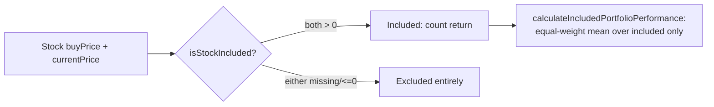

# Frontend: pure exclusion + re-weighting helpers in projection.js

## Summary

Adds the JS single source of truth for the "exclude stocks we can't price"
rule (parent #270) to `docs/projection.js`, mirroring the Rust backend's
`is_priceable` predicate (`src/utils.rs`). This gives the upcoming app.js
aggregate and strikethrough sub-issues one tested rule to reuse. Closes #288.

Two pure helpers were added and exported on `globalThis.GRQProjection`:

- **`isStockIncluded(buyPrice, currentPrice)`** — returns `true` only when both
  prices are present numbers strictly greater than 0 (a stock is included iff it
  has a usable buy price AND a usable current price). Missing, zero, negative,
  `NaN`, `null`/`undefined`, or non-numeric inputs all exclude the stock,
  matching the backend's `buy_price > 0.0 && current_price > 0.0` rule.
- **`calculateIncludedPortfolioPerformance(stocks)`** — equal-weight mean of the
  total returns (price + dividend, via the existing `calculatePerformanceReturn`)
  over **only** the included stocks. Excluded stocks are dropped entirely, so
  excluding one redistributes weight equally over the remainder (two of three
  included → ½ each, not ⅓). Returns `null` when no stock is included.

No production wiring changes yet — this is the foundation the app.js aggregate
and strikethrough sub-issues build on.



## Evidence

Pure-function module change with no visible UI; verified via the Deno unit
suite rather than a screenshot. The shipped helpers in `docs/projection.js` are
imported directly by the tests (no mocks), so the tests exercise the exact code
the dashboard will use.

Test run:

```
deno test --allow-read tests/exclusion_reweight_test.ts
ok | 12 passed | 0 failed

deno test --allow-read tests/*.ts
ok | 506 passed (55 steps) | 0 failed
```

## Test Plan

New `tests/exclusion_reweight_test.ts` (TDD — written failing first):

- `isStockIncluded` — both prices present → included; missing buy price →
  excluded; missing current price → excluded; both missing → excluded; negative
  prices → excluded; non-numeric / `NaN` → excluded.
- `calculateIncludedPortfolioPerformance` — averages returns over included
  stocks only; excluding one redistributes weight over the remainder; includes
  dividend return; all excluded → `null`; empty / invalid input → `null`.
- Asserts both helpers are published on `globalThis.GRQProjection`.
