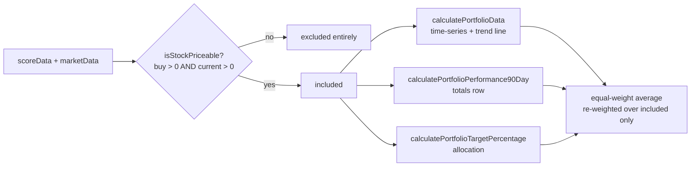

# Frontend: exclude unpriceable stocks from portfolio aggregate & trend line

## Summary

The dashboard's portfolio maths previously counted every stock, even those that
cannot be priced (delisted, merged for cash, renamed — no usable buy and/or
current price). This dragged portfolio performance down, diluted the allocation,
and — when a stock had no buy price in the score-date window — injected a
non-finite value (`Infinity`/`NaN`) into the portfolio time-series that feeds the
trend line.

This change applies the shared inclusion rule (`isStockIncluded` from
`projection.js`, the single source of truth mirrored from the Rust backend's
`is_priceable`) across all of the dashboard's portfolio aggregation in
`docs/app.js`:

- A new `isStockPriceable(stockSymbol, scoreDate)` helper resolves a stock's buy
  price (score date) and current price (latest market data) and delegates the
  decision to `GRQProjection.isStockIncluded`.
- `calculatePortfolioData` (the time-series feeding the portfolio trend line)
  now skips excluded stocks entirely, before the inline price-return maths, so a
  null buy price can no longer produce a non-finite point.
- `calculatePortfolioPerformance90Day` (the totals row) skips excluded stocks.
- `calculatePortfolioTargetPercentage` and the portfolio-target popover
  (`getWorking`) skip excluded stocks so the displayed allocation and stock list
  reflect only the included remainder.

Excluding a stock drops it from the equal-weight average, which re-weights the
portfolio over the included stocks only (e.g. two of three included stocks are
weighted 1/2 each, not 1/3). Numbers stay consistent with the trend line
(#273), the per-stock performance display (#272/#274) and the shared helpers
(#288).

Closes #289.

## Evidence

Dashboard rendered against `2026/April/01.tsv` after the change — the Portfolio
Performance Over Time chart (with the portfolio trend line), the Market
Performance Comparison row and the Individual Stock Performance table with its
totals row all render with finite, re-weighted figures (no `NaN`/`Infinity`,
no load error):

### Data flow

## Test Plan

New `tests/portfolio_exclusion_test.ts` mirrors the production glue while
delegating every numeric decision to the real shipped kernels in
`docs/projection.js` (`isStockIncluded`, `currentPriceFromLatest`,
`getBuyPrice`), following the established pattern in
`portfolio_view_consistency_test.ts` and `chart_data_test.ts`:

- `isStockPriceable` — included when both prices usable; excluded for a delisted
  stock (no data) and for a stock with data but no buy price in the window.
- `calculatePortfolioData` — excludes unpriceable stocks and re-weights the
  remainder; never yields a non-finite series point; two included stocks are
  equal-weighted (mean of +20%/+40% = +30%, not /3). These three assertions were
  verified to **fail** without the exclusion guard and pass with it.
- `calculatePortfolioPerformance90Day` — totals reflect only included stocks;
  all-excluded → 0.
- `calculatePortfolioTargetPercentage` — allocation reflects only included
  stocks.

Full gate: `./quality.sh` passes (Rust suite + 515 Deno tests, lint, fmt,
check).
