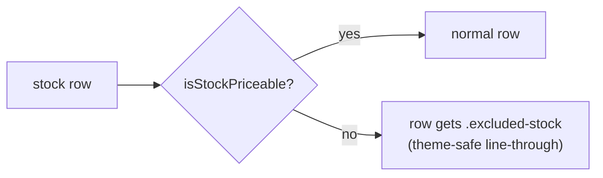

## Summary

Excluded stocks are now signalled on the dashboard aggregate table by striking
out their row, indicating they are out of **all** portfolio calculations.
Closes #290.

A stock is *excluded* when it fails the shared inclusion predicate
`GRQProjection.isStockIncluded` (missing or non-positive buy **or** current
price — delisted, merged for cash, renamed). The aggregate row builder in
`docs/app.js` now adds an `excluded-stock` class to that stock's `<tr>`
(reusing the existing `isStockPriceable` helper, so the strikethrough cannot
drift from the maths that drops the stock from the portfolio totals).

`docs/styles.css` renders `.excluded-stock td` with
`text-decoration: line-through`. The line is drawn on the cell text in
`currentColor`, so the row keeps its inherited theme text colour at **full
strength — no opacity dimming**. That preserves the same WCAG 2 AA contrast as a
normal row in **both** the light and dark themes (coordinates with #281). The
ticker cell, which sets its own `text-decoration: underline`, is given
`underline line-through` so it stays an underlined link *and* is struck through.

Per the explicit issue requirement, **no "N of M excluded" summary line** was
added.

## Evidence

Browser screenshot capture was unavailable in this run — the headless Chrome
compositor in the sandbox never produced a frame (`Page.captureScreenshot`
timed out across `--headless`, `--headless=new`, CDP-attach, swiftshader and
sandbox-disabled attempts). Per the Error-Recovery guidance, verification is
documented via automated tests and the CI accessibility gate instead.

- **Automated tests** (`tests/excluded_stock_strikethrough_test.ts`) — full
  suite: `deno test --allow-read tests/*.ts` → **521 passed, 0 failed**.
  - The row-exclusion decision is exercised through the **real** shipped
    `isStockIncluded` predicate (included → no class; missing/zero buy or
    current price → `excluded-stock`).
  - The CSS deliverable is pinned: `.excluded-stock` is struck through and is
    theme-safe (asserts the rule does **not** dim the text with a
    contrast-reducing `opacity`).
- **Contrast in both themes** is gated by the repo's pa11y-ci check
  (`pa11yci.json` runs `index.html` and `index.html?theme=dark` against
  `WCAG2AA`). Because the strikethrough preserves the row's normal theme text
  colour, contrast is identical to an unmodified row in each theme.
- **Expected visual result**: an excluded stock's entire aggregate row (ticker
  through dividends) shows a strikethrough line in the current theme text
  colour; the ticker remains an underlined link with the strikethrough applied;
  included rows are unchanged.

## Test Plan

- Added `tests/excluded_stock_strikethrough_test.ts`:
  - `excluded row - included stock is NOT struck through`
  - `excluded row - missing buy price is struck through`
  - `excluded row - missing current price is struck through`
  - `excluded row - non-positive prices are struck through`
  - `styles.css: excluded rows are struck through`
  - `styles.css: strikethrough is theme-safe (no contrast-reducing dim)`
- Ran `deno test --allow-read tests/*.ts` (521 passed), `deno lint`,
  `deno check`, `deno fmt`, and `cargo check --all-targets` (clean — Rust
  untouched).
