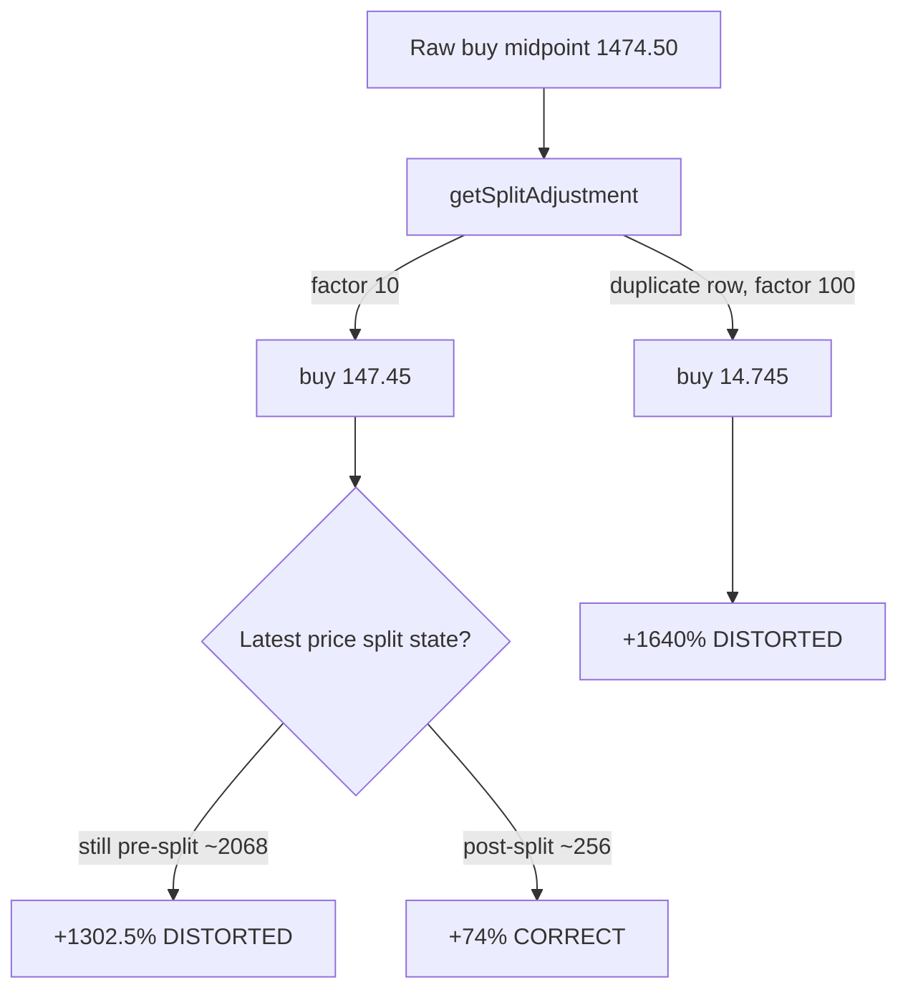

## Summary

Investigation/spike for KLAC's split-distorted return (parent #272). **No
production code is changed** — this run pins the root cause with exact numbers,
freezes a deterministic regression fixture, and documents the agreed
"implausible split coefficient" thresholds that the #272 code sub-issues will
consume. Closes #291.

**Root cause.** `getSplitAdjustment` (`docs/projection.js:223-232`) multiplies
**every** `split_coefficient > 1.0` recorded after the buy date with no
de-duplication, no plausibility bound, and no reconciliation against the
observed buy/current price ratio. `getBuyPrice` divides the historical buy
midpoint by that cumulative factor while `currentPriceFromLatest` assumes the
latest price is already post-split, so an over-large factor — or a buy/current
split-state mismatch — over-divides the buy price and inflates the return that
feeds the "Capital" column.

**Numbers (score/buy date 2026-03-11, raw buy midpoint 1474.50):**

| State | Factor | Buy | Current | Return |
| --- | --- | --- | --- | --- |
| Distorted (current still pre-split) | 10 | 147.45 | 2068.00 | **+1302.5%** |
| Reconciled (split applied both sides) | 10 | 147.45 | 256.63 | **+74.0%** |
| Duplicate split row (no de-dup) | 100 | 14.745 | 256.63 | **+1640%** |

The single 10:1 coefficient divides the buy price to **$147.45** — exactly the
"$147.45 buy price" the reporter observed. The committed
`docs/scores/2026/March/11.csv` now carries post-split latest prices, so the
real kernels already yield the correct **+74.4%** — the live distortion
self-healed via a data refresh, so it is reproduced only from the frozen
fixtures, never from live state.

Findings + thresholds: `docs/fixes/klac-split-distortion-investigation.md`.
The same findings and threshold proposal are posted as comments on #291 and #272.

## Evidence

Backend/CLI + dashboard-maths investigation — no UI change to screenshot. The
evidence is the deterministic reproduction test exercising the **real**
`docs/projection.js` kernels over the frozen fixtures:

```
running 4 tests from ./tests/klac_split_distortion_test.ts
KLAC split distortion - inflated return reproduced from fixture ... ok
KLAC split reconciled - correct return when split applied both sides ... ok
Clean control - no split, no distortion, modest return ... ok
Duplicate split coefficient compounds the factor (no de-dup defect) ... ok
ok | 4 passed | 0 failed
```



## Test Plan

- Added `tests/klac_split_distortion_test.ts` — runs the real
  `getBuyPrice`/`getSplitAdjustment`/`currentPriceFromLatest`/
  `calculatePerformanceReturn` kernels over the frozen fixtures and asserts the
  inflated (+1302.5%), reconciled (+74.0%), clean-control (+15.0%) figures and
  the duplicate-split factor (10 → 100).
- Added frozen fixtures under `tests/fixtures/`:
  `klac_split_distorted.csv`, `klac_split_reconciled.csv`,
  `control_clean_no_split.csv` (+ `tests/fixtures/README.md`).
- `./quality.sh` passes cleanly (Rust fmt/clippy/check/test/coverage/build +
  Deno fmt/lint/check/test).
