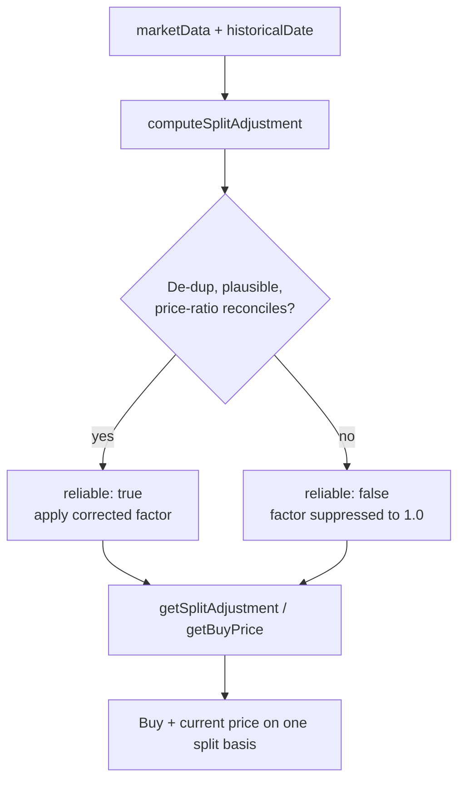

# Frontend: trustworthy split-adjustment in `projection.js`

## Summary

Replaced the unguarded cumulative split multiply in `docs/projection.js` with a
single validated "correct-or-flag" computation, fixing the KLAC split distortion
(parent #272). **Closes #292.**

A new pure helper `computeSplitAdjustment(marketData, historicalDate) → { factor,
reliable }` decides split-truth in one tested place:

- **De-duplicates** split events recorded within five days of each other (the
  same corporate event written twice) — prevents the factor-100 duplicate case.
- **Rejects implausible coefficients**: a single `splitCoefficient` above `10:1`,
  or a cumulative factor above `50`, flips `reliable: false`. Invalid
  coefficients (`NaN`, `≤ 0`) are treated as `1.0` (no adjustment).
- **Cross-checks** each split against the observed pre/post price drop: a real
  `N:1` split divides the price ~`N`-fold (±15%). When the price never dropped
  (the KLAC distortion — the latest price was never split-adjusted), the series
  is flagged unreliable.

`getSplitAdjustment` and `adjustHistoricalPriceToCurrent` now consume the helper
and **refuse to apply a factor they cannot reconcile** — returning `1.0` instead
of silently inflating the return. `getBuyPrice` surfaces the same `reliable`
flag in its return object so buy and current price stay on one consistent
post-split basis, and the inclusion predicate (`isStockIncluded`, #288) can reuse
it. The helper is exported via `globalThis.GRQProjection`, so every `app.js` call
site is corrected at once.

Thresholds match the agreed spike values in
`docs/fixes/klac-split-distortion-investigation.md` (updated with an
implementation note).

## Evidence

Backend/CLI + frontend-helper change with no new UI surface to screenshot — the
helpers are pure functions verified by the Deno test suite against the frozen
KLAC fixtures. Key behavioural proof:

| Fixture | Before #292 | After #292 |
| --- | --- | --- |
| `klac_split_distorted.csv` | factor 10 applied → **+1302.5%** | `reliable: false`, factor suppressed to 1.0 → **no inflation (< +300%)** |
| Duplicate split row | compounded to **factor 100** (buy 14.745) | de-duplicated to **factor 10** (buy 147.45) |
| `klac_split_reconciled.csv` | +74% | **+74%** (unchanged, reliable) |
| `control_clean_no_split.csv` | +15% | **+15%** (unchanged, reliable) |

## Test Plan

New tests in `tests/projection_kernels_test.ts` (added alongside the existing
kernels):

- `computeSplitAdjustment: clean single split -> corrected, reliable`
- `computeSplitAdjustment: no-split series -> factor 1.0, reliable`
- `computeSplitAdjustment: duplicate split rows are de-duplicated`
- `computeSplitAdjustment: distinct splits beyond the window compound`
- `computeSplitAdjustment: implausible coefficient -> unreliable`
- `computeSplitAdjustment: price-ratio mismatch -> unreliable`
- `computeSplitAdjustment: invalid coefficient treated as no split`
- `getSplitAdjustment suppresses an unreliable factor (no inflation)`
- `getBuyPrice surfaces the reliability flag`

Updated (documented business-logic change) in
`tests/klac_split_distortion_test.ts` — two reproduction tests that asserted the
**defective** numbers now assert the **corrected** behaviour:

- `KLAC split distortion - corrected: flagged unreliable, no inflation (#292)`
- `Duplicate split coefficient is de-duplicated, not compounded (#292)`
- The reconciled (+74%) and clean (+15%) controls are unchanged.

All 507 Deno tests pass; `deno lint`, `deno check`, and `./quality.sh` (Rust
build/tests/clippy + Deno) green.
