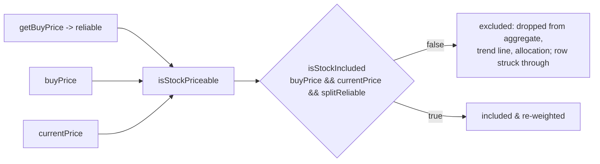

## Summary

Extend the **single** `isStockIncluded` inclusion predicate so a stock whose
split/merge series cannot be reliably reconciled (`reliable: false` from the #292
split-adjustment helper) is excluded from **all** prediction-accuracy /
portfolio figures — re-weighting the remainder and striking the row through —
without adding any parallel "is this stock OK?" mechanism (DRY, per the #272
scope). Closes #293.

The predicate gains an optional third input:

```js
isStockIncluded(buyPrice, currentPrice, splitReliable = true)
// included only when both prices are usable AND splitReliable !== false
```

`splitReliable` defaults to `true` and **only an explicit `false` excludes**, so
every existing two-argument caller keeps its behaviour. The dashboard's single
`isStockPriceable` gateway feeds in `getBuyPrice(...).reliable` (already surfaced
by the #292 helper), so the aggregate/totals row, the portfolio trend line, the
count/allocation, and the row strikethrough all inherit split-exclusion with **no
extra wiring** — they already route through that one predicate.

### What changed

- `docs/projection.js`
  - `isStockIncluded(buyPrice, currentPrice, splitReliable = true)` — split
    reliability now participates in the one predicate.
  - `calculateIncludedPortfolioPerformance` — passes each stock's optional
    `splitReliable` flag through the same predicate, so re-weighting drops
    split-unreliable stocks too.
- `docs/app.js`
  - `isStockPriceable` — resolves `buyPriceObj.reliable` and feeds it into
    `isStockIncluded`. Every consumer (time-series, aggregate, allocation,
    strikethrough) already calls `isStockPriceable`, so this is the only glue
    change needed.

### Dependency note

Issue #293 sits at the intersection of two milestones: it needs the
`reliable` flag from `milestone/272` (#291/#292, already present) **and** the
`isStockIncluded` + re-weighting + strikethrough mechanism from `milestone/270`
(#288/#289/#290). This branch merges `milestone/270` in so the predicate exists
to extend; once #270 lands in #272 those shared commits collapse and the net
diff is just the #293 change above.

## Evidence

The split-unreliable row (the KLAC spike: a distorted `+1302.5%` Capital figure)
is struck through and dropped from every figure, in **both** the light and dark
themes. The strikethrough is drawn in `currentColor` with no opacity dimming, so
it keeps the same WCAG 2 AA contrast as a normal row; the ticker cell stays an
underlined link **and** is struck through.




## Test Plan

All TDD, exercising the **real** shipped helpers (`docs/projection.js`):

- `tests/exclusion_reweight_test.ts`
  - predicate returns `false` for a split-unreliable stock with both prices present;
  - `true` when split-reliable; omitted/`undefined` flag defaults to included (backwards compatible);
  - reliability never rescues a bad price;
  - re-weighting averages over the included remainder when a split-unreliable stock is dropped.
- `tests/excluded_stock_strikethrough_test.ts`
  - a split-unreliable stock receives the `excluded-stock` strikethrough class via the same predicate;
  - existing theme-safe CSS assertions (light + dark) still hold.
- `tests/portfolio_exclusion_test.ts` (end-to-end dashboard glue mirror)
  - an implausible 20:1 split coefficient drives `getBuyPrice -> reliable:false`, so the stock is excluded from `isStockPriceable`, the aggregate totals, and the allocation — never injecting its split-distorted return.

`deno task test` / full `deno test` (544 passed) and `./quality.sh` both green.
