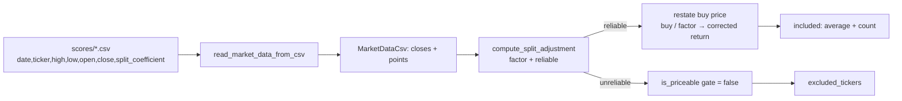

## Summary

The Rust backend previously ignored stock splits entirely: `read_market_data_from_csv`
parsed only the `close` column, and `calculate_portfolio_performance` used the raw
close for both buy and current price, so a split inside the 90-day window distorted
the return. This PR mirrors the frontend correct-or-exclude rule in the backend and
reuses #286's exclusion plumbing rather than building a parallel one. **Closes #294.**

What changed:

- **`read_market_data_from_csv`** now parses the `split_coefficient` (and `high`/`low`)
  columns and returns a `MarketDataCsv { closes, points }`. `closes` preserves the
  original `ticker → date → close` shape consumed by existing callers; `points`
  carries the split-relevant daily figures. A missing/invalid coefficient is treated
  as `1.0` (no split).
- **`compute_split_adjustment`** is a Rust mirror of the frontend
  `computeSplitAdjustment`, using the same agreed thresholds: de-duplicate split
  events within 5 days, flag any single coefficient above 10, cap the cumulative
  factor at 50, and cross-check each split against the observed pre/post price drop
  within ±15%. It returns `{ factor, reliable }`.
- **`calculate_portfolio_performance`** computes the buy date, then reconciles any
  split between the buy date and the current-price date. A **reliable** series
  restates the buy price into post-split terms (`buy / factor`) so the return is
  correct; an **unreliable** series excludes the stock.
- **`is_priceable`** gains a third `split_reliable` argument (mirroring the frontend
  `isStockIncluded`), so split-unreliable stocks drop through the single gate — out of
  the average, out of the included `total_stocks` count, and into `excluded_tickers`.
  With no split, the factor is `1.0` and behaviour is identical to before.

Backend and frontend share the same thresholds, so their exclusion outcomes stay
consistent.

### Deno regression avoided

This is a Deno + Rust repo; the work was done entirely in Rust (`cargo test`,
`cargo clippy`) and verified against the existing Deno consistency suite — no
Node tooling was introduced.

## Evidence

Backend/CLI change with no web interface to screenshot. Verified via `cargo test`
and the full `./quality.sh` gate (Rust tests + clippy + coverage, plus 544 Deno
tests including the split/consistency suites), all green.

Data flow:

## Test Plan

New tests in the `#[cfg(test)]` module of `src/utils.rs`:

- `test_compute_split_adjustment_no_splits_is_reliable_unity` — no splits → factor 1.0, reliable.
- `test_compute_split_adjustment_clean_single_split` — reconcilable 2:1 → factor 2.0, reliable.
- `test_compute_split_adjustment_deduplicates_repeated_event` — duplicate within 5 days applied once (factor 2.0, not 4.0).
- `test_compute_split_adjustment_implausible_coefficient_unreliable` — coefficient > 10 → unreliable.
- `test_compute_split_adjustment_price_ratio_mismatch_unreliable` — coefficient that does not match the price drop → unreliable.
- `test_compute_split_adjustment_ignores_splits_before_buy_date` — splits before the buy date do not adjust.
- `test_portfolio_performance_corrects_clean_split` — clean split corrected to +10% and included (buy basis restated to 50).
- `test_portfolio_performance_excludes_implausible_split` — implausible split excluded: not in the average, not in the count, present in `excluded_tickers`; clean stock still counted.
- `test_portfolio_performance_no_split_unchanged` — no-split stock behaves exactly as before.
- `test_is_priceable_split_unreliable_excludes_otherwise_priceable_stock` — split-unreliable stock dropped through the single gate.

Modified existing tests (required by the `is_priceable` signature change and the
`MarketDataCsv` return type; behaviour-preserving, documented inline):

- The `test_is_priceable_*` cases and the two `test_portfolio_performance_excludes_*`
  sanity tests pass `true` for the new `split_reliable` argument.
- `test_read_market_data_from_csv_skips_unparseable_close` reads `.closes` from the
  new `MarketDataCsv` return value.
