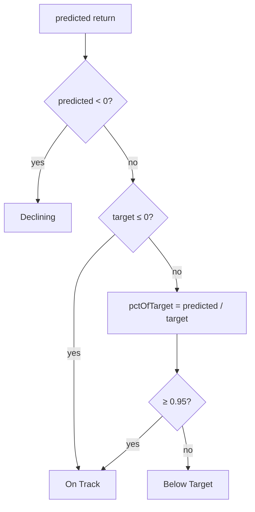

# Fix computeJudgement sign-flip — positive return no longer reads as "Declining"

## Summary
On the scores view, stocks with clear gains showed a red **"Declining"** status
badge: NASDAQ:STLD (realised **+33.5%**) read `Declining (45.5%)` and NYSE:GE
(**+14.7%**) the same

Root cause was in `computeJudgement` (`docs/projection.js`). `target` is the
**target return %**, not a price. When a stock's model 90-Day Target *price*
sits below its buy price, the target return % is **negative**. The old
`pctOfTarget = predicted / target` then flipped the sign of a healthy positive
projection, so `predicted < 0 || pctOfTarget < 0.2` was true and the kernel
returned `"Declining"`. `getJudgementClass` maps `"Declining"` → red, so fixing
the kernel corrects STLD, GE, and every stock in the status column at once.

The fix judges direction by the **sign** of the predicted return first (only a
negative projection is `"Declining"`) and guards the ratio against a
non-positive `target`. A positive projection is now `"On Track"` or
`"Below Target"`, never `"Declining"`.

Closes #297.

## Evidence
This is a pure scoring-kernel (non-UI) change, verified by behavioural tests
that drive the real exported `GRQProjection.computeJudgement` and assert on the
shipped judgement strings. The new tests fail before the fix and pass after.

Before → after for the reported cases:

| Case | target % | predicted % | Before | After |
|------|----------|-------------|--------|-------|
| STLD | −2 | +45.5 | `Declining (45.5%)` | not `Declining` |
| GE   | −1.5 | +12.3 | `Declining (12.3%)` | not `Declining` |



Test run:

```
ok | 3 passed (9 steps) | 0 failed
```

`./quality.sh` passes cleanly.

## Test Plan
Added to `tests/judgement_tests.ts` (new test
`computeJudgement - positive projection with a non-positive target (issue #297)`):
- **STLD-like** — confident projection `+45.5`, `targetPercentage = -2`; asserts
  the result does not start with `"Declining"`.
- **GE-like** — smaller positive projection `+12.3`, `targetPercentage = -1.5`;
  asserts not `"Declining"`.
- **Negative projection** — `-8.0` with a negative target still returns
  `"Declining"` (no regression in the genuine-decline path).
- **Small positive vs positive target** — `+2.0` against target `20` is
  `"Below Target"`, not `"Declining"`.

Existing `computeJudgement` realised-outcome and early-stage tests continue to
pass unchanged.
