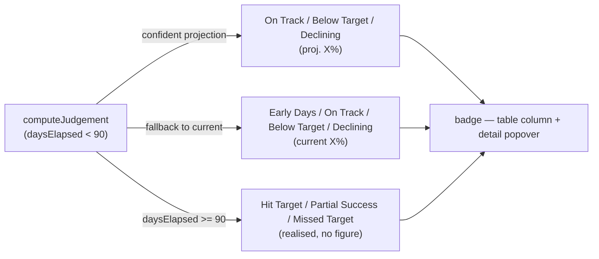

## Summary

The status/projection badge previously read `Declining (45.5%)` (or `On Track
(45.5%)`, `Early Days (+3.2%)`, …) where the bare parenthetical was either the
**projected 90-day** return or the **current** return-so-far, with nothing to
say which. Shown next to a stock's realised headline gain, this invited the
exact misreading reported in #274.

`computeJudgement` (`docs/projection.js`) now labels every pre-day-90
parenthetical:

- a confident projection reads `proj.` — e.g. `On Track (proj. 45.5%)`,
  `Declining (proj. -8.0%)`, `Below Target (proj. 12.3%)`;
- a current-performance fallback reads `current` — e.g.
  `Early Days (current +3.2%)`, `Below Target (current 8.0%)`,
  `Declining (current -5.0%)`.

From day 90 the realised buckets (`Hit Target`, `Partial Success`,
`Missed Target`) are unchanged — they carry no figure, so there is nothing to
mislabel. Because both the status column and the detail popover render the same
`judgement` string, the labelling is automatically consistent across the two.

`GRQValidator.getJudgementClass` (`docs/app.js`) coloured "Early Days" badges by
matching the old `(+`/`(-` prefix; the new `current` qualifier moved the sign,
so the heuristic now matches on the sign character itself — colours are
preserved (green for a positive return, red for a negative one).

This is the wording/labelling half of #274; the kernel sign-flip
classification fix landed separately in #297 and is untouched here.

Closes #298.

## Evidence

Headless-Chrome render of the real `GRQProjection.computeJudgement` output with
the production badge classes/colours applied:

## Test Plan

- Added `tests/judgement_tests.ts::computeJudgement - figures are labelled
  projected vs current (issue #298)`, covering:
  - confident projections labelled `proj.` (On Track / Below Target / Declining),
  - current-performance fallbacks labelled `current` (Early Days up/down and the
    30–90 day fallback),
  - day-90 realised buckets carry no `proj.`/`current` figure.
- Existing judgement tests (`tests/judgement_tests.ts`,
  `tests/judgement_hybrid_test.ts`, `tests/projection_kernels_test.ts`) continue
  to pass — they assert via `startsWith`/`includes`, which the new format
  satisfies.
- Full suite: `deno test --allow-read tests/*.ts` → 523 passed, 0 failed.
  `deno fmt`, `deno lint`, `deno check` all clean.
