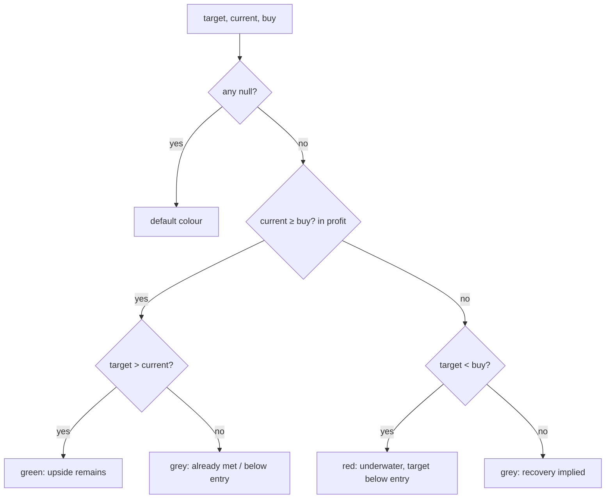

# Reconsider red 90-Day Target price colour next to a positive return

## Summary
The **90-Day Target price** rendered red ("danger") whenever the target price
sat below the buy price — even when the position was in profit. For STLD the
target ($184.36) is below buy ($188.35), so the price showed red while sitting
directly next to a large green realised gain, reading as self-contradictory
(part of #274).

`getTargetPriceColor` (`docs/projection.js`) now reserves red for a genuinely
bad position: red fires **only when the position is underwater** (current price
below buy) **and** the target stays below entry. When the position is in profit
(current >= buy) the target is green (upside still implied) or grey (target
already met / below entry), **never red**. This mirrors the sibling fix #297,
which stopped a positive projected return reading as a red "Declining" badge —
red should never sit next to a positive return.

The target *value* is unchanged (target correctness is out of scope for #274) —
this is a colour/presentation change only.

Closes #299.

## Evidence
This is a pure display-kernel change. `getTargetPriceColor` is exported on
`globalThis.GRQProjection` and the dashboard delegates to it, so the new
behavioural tests drive the **real production logic**, not a copy. Playwright
MCP was not available in this environment, so verification is via the exported
kernel (the same approach as #297).

Before → after, class tokens returned by the real exported function:

| Case | target | current | buy | Before | After |
|------|--------|---------|-----|--------|-------|
| STLD-like (in profit, target < buy) | 184.36 | 200.00 | 188.35 | `price-bad` (red) | `price-neutral` (grey) |
| In profit, target above current | 70 | 60 | 55 | `price-good` (green) | `price-good` (green) |
| Underwater, target below buy | 40 | 50 | 55 | `price-bad` (red) | `price-bad` (red) |
| Underwater, target at/above buy | 70 | 50 | 55 | `price-neutral` (grey) | `price-neutral` (grey) |

Only the in-profit / target-below-buy case changes — exactly the contradictory
case the issue reports. Genuine danger (underwater with a sub-entry target)
stays red.

Test run (`deno test --allow-read tests/*.ts`): `539 passed | 0 failed`.

## Test Plan
Updated `tests/fair_value_color_test.ts`:
- **Renamed** `…- target below buy price is red (always bad)` →
  `…- target below buy is red ONLY in loss territory`, asserting `(40, 50, 55)`
  (underwater) is still red.
- **Added** `…- target below buy while in profit is NOT red (issue #299)`:
  the STLD-like case `(40, 60, 55)` now returns grey, not red — the regression
  guard for #299.
- Existing green / grey / null / boundary cases are unchanged and still pass.
