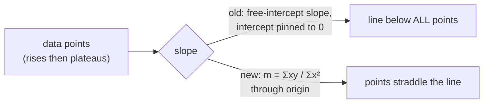

# Single-stock trend line: regression through the origin

## Summary
The single-stock trend line sat **below all** performance points on charts that
rise fast then plateau. `computeTrendLine()` in `docs/projection.js` fitted a
**free-intercept** least-squares slope and then pinned the intercept to `0`,
keeping a slope that only made sense alongside a non-zero start. A slope fitted
for a non-zero intercept, anchored at `0%` on day 0, drops the whole line below
the data.

The fix recomputes the slope as a **regression through the origin** (line pinned
to `(0,0)`), which minimises `Σ(y − m·x)²` and gives `m = Σ(x·y) / Σ(x·x)`. The
dead free-intercept computation and the now-unused `sumX`/`sumY`/`n` terms were
removed. Day 0 stays `0%` (anchor unchanged); `predicted90DayPerformance` shifts
with the corrected slope (accepted consequence per #273); `calculateRSquared`
continues to measure the line actually drawn.

Closes #302.

## Evidence
Backend/pure-function change — no web UI to screenshot. Verified via Deno tests
calling the real exported `computeTrendLine`.

Before the fix the rises-then-plateaus fixture produced slope `3.0` (every
non-origin point strictly above the line). After the fix the slope is
`Σxy/Σx² ≈ 4.385` and at least one point lies on/below the line.

## Test Plan
- Added `tests/trend_line_origin_regression_test.ts`:
  - `computeTrendLine: rises-then-plateaus line is not below all points` —
    asserts `slope === Σxy/Σx²`, `intercept === 0`, day-0 value `0%`, and that
    the line is not strictly below every point. This reproduces #302 (fails
    against the unfixed code with slope `3.0`).
  - `computeTrendLine: recovers the exact rate for a linear-from-origin series`
    — sanity check that a `y = 3x` series recovers slope `3` with `R² = 1`.
- All existing tests pass, including `tests/projection_kernels_test.ts` and
  `tests/trend_line_extension_test.ts`.
- `./quality.sh` passes cleanly.
