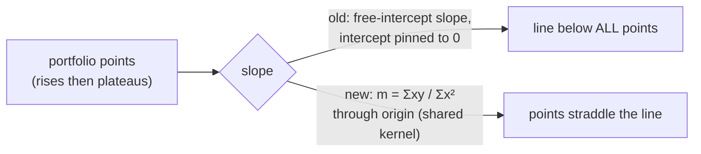

# Portfolio trend line: regression through the origin

## Summary
The dashed **"Portfolio Trend (Low Confidence)"** line sat **below all**
Performance points on portfolio charts that rise fast then plateau.
`calculatePortfolioTrendLine()` in `docs/app.js` fitted a **free-intercept**
least-squares slope **and** intercept, then discarded the intercept (forced `0`)
while keeping the free-intercept slope. A slope fitted for a non-zero start,
anchored at `0%` on day 0, drops the whole line below the data.

The fix delegates the portfolio regression to the single shared kernel
`GRQProjection.computeTrendLine()` (`docs/projection.js`) — the same kernel the
single-stock trend line now uses (#302). It fits a **regression through the
origin** pinned to `(0,0)`, minimising `Σ(y − m·x)²`, which gives
`m = Σ(x·y) / Σ(x·x)`, intercept `0`. The now-dead free-intercept
`slope`/`intercept` computation and the `sumX`/`sumY`/`n` terms were removed,
along with the orphaned per-class `calculateRSquared()` (the shared kernel
computes R² internally). Day 0 stays `0%`; `predicted90DayPerformance` shifts
with the corrected slope (accepted consequence per #273); R² keeps measuring the
line actually drawn. No change to the line's colour/label.

Closes #303.

## Evidence
Browser-only UI maths — the dashboard needs live per-stock market data to
render, so (mirroring #302) the change is verified via Deno tests that call the
real shipped kernel the production code now delegates to. The portfolio glue is
a thin wrapper that builds `{ x: daysSinceScore, y: portfolioReturn }` points
and forwards them to `computeTrendLine`.

Acceptance criteria met: `slope === Σ(x·y) / Σ(x·x)`, `intercept === 0`,
day-0 value exactly `0%`, and the line is not below every Performance point.

## Test Plan
- Added `tests/portfolio_trend_line_origin_test.ts`:
  - `portfolio trend line: rises-then-plateaus is not below all points` —
    asserts `slope === Σxy/Σx²`, `intercept === 0`, day-0 value `0%`, and that
    the line is not strictly below every point (reproduces #303).
  - `portfolio trend line: 90-day prediction tracks the through-origin slope` —
    asserts the prediction equals `slope * 90` floored at `-100%`.
- Existing `tests/portfolio_view_consistency_test.ts` (which already models the
  delegation to `computeTrendLine`) and `tests/trend_line_origin_regression_test.ts`
  continue to pass.
- Full `./quality.sh` passes (lint, type checks, Rust + Deno tests).
