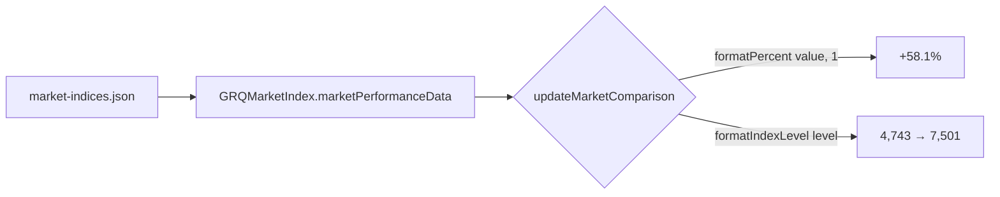

## Summary

The dashboard's benchmark-comparison panel rendered market-index levels with two
decimal places (e.g. `7,500.42`) and the percentage change with two decimals.
Index levels are large whole-number figures and don't need decimal points, and
the percentage change reads better with a single decimal.

This PR changes the shared formatting so:

- **Index levels** (`formatIndexLevel`) default to **0 decimals** with thousands
  separators — SP500 now reads `7,501`, not `7,500.42`.
- **Percentage change** in the market-comparison panel renders to **one decimal
  place** (e.g. `+58.1%`).

Both helpers retain an explicit `decimals` argument, so callers can still
request more precision where needed.

Closes #313.

## Evidence

Playwright MCP was not available in this environment, so no live browser
screenshot could be captured. Instead the change was verified by running the
**real shipped helpers** (`docs/format.js`) against the committed market data
(`docs/market-indices.json`):

```
SP500        pct=+58.1%   levels=4,743 → 7,501
NASDAQ       pct=+79.6%   levels=14,766 → 26,518
RUSSELL2000  pct=+48.0%   levels=2,013 → 2,980
```

Index levels show no decimal points; the percentage change shows one decimal —
matching the issue's requirement (SP500 formatted as `7,500`).



## Test Plan

- Updated `tests/format_test.ts::formatIndexLevel formats an index level with no
  decimals by default (issue #313)` — asserts `7500.42 → "7,500"`,
  `4742.83 → "4,743"`, `16057.44 → "16,057"`. This reproduces the bug (failed
  before the fix) and passes after.
- Added `tests/format_test.ts::formatIndexLevel still honours an explicit
  decimals argument` — confirms `formatIndexLevel(4742.83, 2) === "4,742.83"`.
- Existing `formatPercent` tests already cover the one-decimal case
  (`formatPercent(12.5, 1) === "+12.5%"`).
- `./quality.sh` passes cleanly (cargo fmt/clippy/check/test, deno
  test/fmt/lint/check).

### Business-logic change to existing test

The previous `formatIndexLevel formats an index level with separators` test
asserted two-decimal output (`4742.83 → "4,742.83"`). That assertion encoded the
old behaviour the issue asks to change, so it was updated to the new
no-decimals expectation rather than removed.
