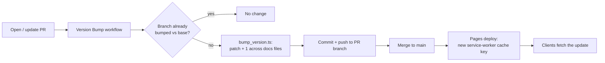

# PR Summary — Issue #323

## Summary

The dashboard app version is the service-worker cache-busting key, so deployed
changes only reach clients when that version changes. The version was bumped by
a local Git pre-commit hook (`setup-hooks.sh` + `scripts/pre-commit`) that only
fired when a contributor had installed it — so versions were frequently not
bumped and **clients did not update**.

This PR moves the bump into CI so it always happens, and removes the unreliable
hooks:

- **`scripts/bump_version.ts`** — increments the patch component of the app
  version across the four aligned locations (`docs/sw.js` `APP_VERSION`,
  `docs/sw-register.js` `./sw.js?v=`, and the `app-version` meta and
  `sw-register.js?v=` script tag in `docs/index.html`). It is **idempotent**
  relative to the PR base branch: if the branch version already differs from
  the base it makes no change, so re-runs never ratchet the version.
- **`.github/workflows/version-bump.yml`** — on every `pull_request`, runs the
  script and commits the bump back to the PR branch. Uses `contents: write`,
  SHA-pinned actions, and guards against fork PRs (no push access) and the
  bot's own commit (self-trigger loop).
- **Removed** `setup-hooks.sh` and `scripts/pre-commit`.
- Documented the flow in `README.md` and `CHANGELOG.md`.

Closes #323.

## Evidence

Backend/CI change — no web UI to screenshot. Verified via the Deno test suite
and an end-to-end run of the script against the real `docs/` files (bumped
`1.0.193 → 1.0.194` across all four locations, then correctly reported "already
bumped" on a second run with the same base).



Test run:

```
ok | 536 passed (55 steps) | 0 failed   # full deno test suite
```

## Test Plan

- **`tests/bump_version_test.ts`** (new) — exercises the real script functions:
  - `bumpPatch` happy path and rejection of malformed versions.
  - `readAppVersion` extraction and the missing-`APP_VERSION` error path.
  - per-file updaters rewrite only the version token.
  - `bumpVersionContents` increments and keeps all four locations aligned,
    bumps when current equals base, is a no-op once already bumped
    (idempotency), and always bumps when no base is supplied.
- **`tests/version_bump_workflow_test.ts`** (new) — structured assertions on the
  parsed workflow: exists, triggers on `pull_request`, invokes
  `scripts/bump_version.ts` via `deno run` with `--allow-read --allow-write`,
  commits and pushes the bump, grants `contents: write`, and pins actions to
  40-char commit SHAs.
- Existing `tests/sw_precache_list_test.ts` continues to pass, confirming the
  four version locations stay aligned after a bump.
