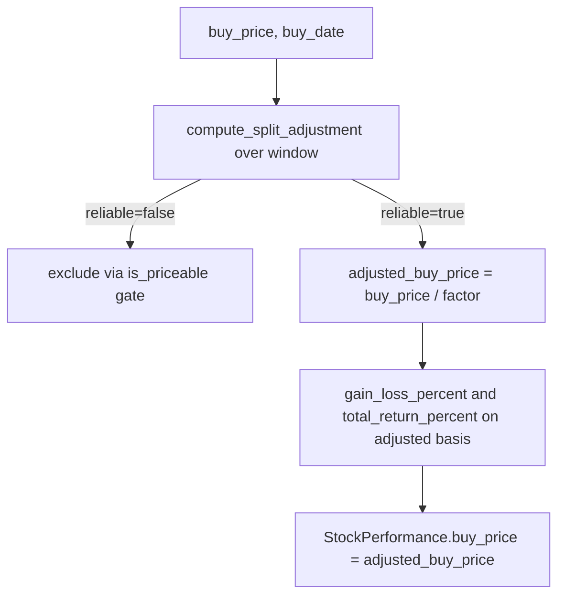

# Restore split-adjustment in `src/utils.rs` (Issue #340)

## Summary

The milestone branch did not build the split-adjustment feature from #294: a
botched merge from `main` dropped the `SplitAdjustment` machinery and the
later "fix" simply reverted `calculate_portfolio_performance` to a raw,
non-split-adjusted `buy_price`. The Rust gate compiled, but the
correct-or-exclude split behaviour the milestone exists to deliver was gone.

This restores the feature to its pre-merge design (commit `3810684`), so
`adjusted_buy_price` is genuinely split-adjusted rather than a rename of
`buy_price`. Closes #340.

Changes in `src/utils.rs`:

1. **`is_priceable` is split-aware again** — third `split_reliable` argument
   restored; the single gate drops split-unreliable stocks (mirrors the
   frontend `isStockIncluded`).
2. **`SplitAdjustment` + `compute_split_adjustment` restored** — de-duplicates
   repeated split events, flags implausible coefficients, caps the cumulative
   factor, and cross-checks each coefficient against the observed price drop.
3. **`calculate_portfolio_performance` reconciles splits** — the buy-price
   binding is now `(f64, NaiveDate)`; `buy_date` scopes which splits fall in the
   holding window; `adjusted_buy_price = buy_price / split.factor` is the basis
   for `gain_loss_percent`, `total_return_percent`, and the reported
   `StockPerformance.buy_price`.
4. **Hybrid projection** passes `true` for split reliability (split correction
   is out of scope for #294), preserving its existing behaviour.

## Evidence

Backend-only change (no web interface to screenshot). Verified via the Rust
test suite and the full quality gate:

- `cargo fmt --all -- --check` — passes
- `cargo clippy --locked --all-targets --all-features -- -D warnings` — passes
- `cargo check --locked --all-targets --all-features` — passes
- `./quality.sh` — runs past the Rust gate through tests and coverage
  (`✅ Quality checks completed successfully!`)

## Test Plan

New/updated tests in `src/utils.rs`:

- `test_is_priceable_*` updated to the three-argument signature; added
  `test_is_priceable_split_unreliable_excludes_otherwise_priceable_stock`.
- `test_compute_split_adjustment_no_splits_is_reliable_unity`
- `test_compute_split_adjustment_clean_single_split`
- `test_compute_split_adjustment_deduplicates_repeated_event`
- `test_compute_split_adjustment_implausible_coefficient_unreliable`
- `test_compute_split_adjustment_price_ratio_mismatch_unreliable`
- `test_compute_split_adjustment_ignores_splits_before_buy_date`
- `test_portfolio_performance_corrects_clean_split` — a clean 2:1 split inside
  the window is corrected (buy basis 100 → 50, return +10%), not excluded.
- `test_portfolio_performance_excludes_implausible_split` — an unreconcilable
  coefficient drops the stock from the average, the count, and into
  `excluded_tickers`.
- `test_portfolio_performance_no_split_unchanged` — a no-split stock is
  unchanged (regression guard).
