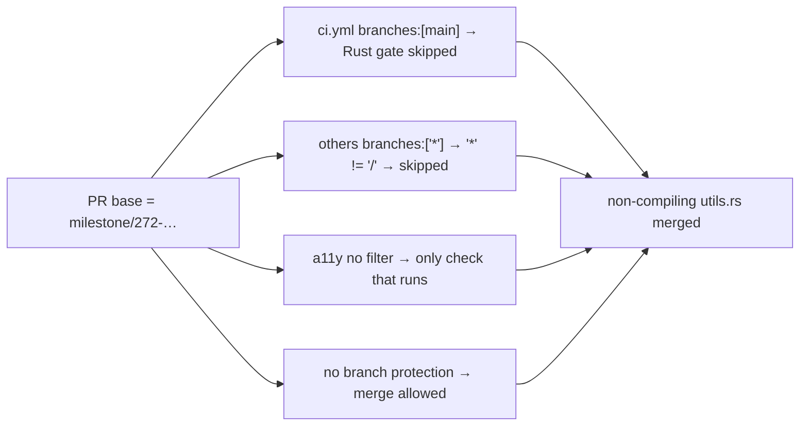

## Summary

Root-cause investigation (no code/behaviour change) into how a non-compiling
`src/utils.rs` reached `milestone/272-…` via PR #324 (Issue #294). The
deliverable is a written report: it confirms — and **expands** — the original
leads, answers all five checklist items with evidence, and hands an ordered gap
list plus remediation to the CI-hardening sub-issue #342. The report is posted
to #326 and committed to the repo at
`docs/archive/investigations/issue-341-milestone-272-ci-gap.md` for permanence.

Closes #341.

### Findings (in one line each)

1. **Primary:** `ci.yml` (the Rust fmt/clippy/check/test gate) triggers only on
   `branches: [ main ]`, so it never ran on PR #324 (base = `milestone/272-…`).
2. **Broader than the lead:** the other quality workflows use `branches: ["*"]`,
   and `*` does not match `/`, so they too skip slashed milestone branches —
   the only check that ran on PR #324/#327 was the unfiltered `a11y.yml`.
3. **No branch protection** on `milestone/272-…` (`protection` API → 404): no
   required checks, no strict up-to-date enforcement.
4. **No bypass needed:** with zero required checks, the merge proceeded
   legitimately on a single green Accessibility check.

Evidence: PRs #324/#327 (base `milestone/272-…`) ran `Accessibility` only,
whereas PRs #325/#351 (base `main`) ran all 11 workflows including
`CI/CD Pipeline`; `check-runs` for `3810684` and `e87068c` returned 0.

## Evidence

This is a documentation/investigation change — no UI and no runtime code. The
evidence is the GitHub Actions / API data captured in the report. See
`docs/archive/investigations/issue-341-milestone-272-ci-gap.md` for the full
writeup, the per-PR comparison table, and the Mermaid diagram of the gap.

## Test Plan

No code paths changed, so no unit tests are added. Verification was empirical
against the live GitHub API and Actions history:

- Confirmed PR #324 head SHA `4e9a346` produced exactly one workflow run
  (`Accessibility`).
- Confirmed `branches: ["*"]` workflows (`cargo-audit`, `deno-quality`, …) ran
  on `main`-based PRs (#325, #351) but not on `milestone/272-…`-based PRs
  (#324, #327), isolating the slash-in-branch-name trigger gap.
- Confirmed `milestone/272-…` branch protection returns HTTP 404.
- `quality.sh` (markdown lint et al.) run clean over the new docs.
