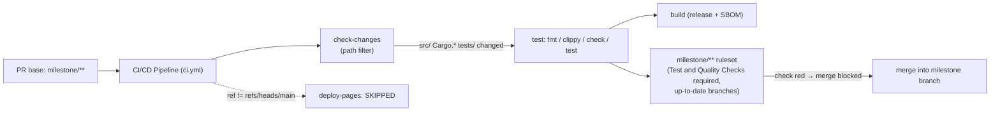

# Harden CI: run the Rust gate on `milestone/**` PRs

## Summary

PRs whose **base** is a `milestone/**` integration branch bypassed the Rust
quality gate: `.github/workflows/ci.yml` triggered only on `push`/`pull_request`
to `main`, so the `test` job (`cargo fmt`/`clippy`/`check`/`test`) never ran on
milestone PRs, and the milestone branches had no branch protection requiring a
green check.

This PR (configuration only — no application code):

1. **Extends the CI triggers** so the gate also runs on milestone branches —
   `milestone/**` is added to both `on.push.branches` and
   `on.pull_request.branches`. The `check-changes` path filter
   (`^(src/|Cargo\.toml|Cargo\.lock|tests/)`) is unchanged, so the `test` job
   still runs when `src/`, `Cargo.*`, or `tests/` change. `deploy-pages` keeps
   its `github.ref == 'refs/heads/main'` guard, so milestone PRs never deploy
   Pages.
2. **Records the intended `milestone/**` branch-protection posture** in
   `.github/branch-protection.json` under a new `milestone_ruleset` block:
   require the `Test and Quality Checks` status check and require branches to be
   up to date before merging. Following the repo's established Issue #180
   pattern, branch-protection settings are not stored in the tree — a
   repository administrator applies them. **The worker account has no admin
   rights (`admin: false`), so it cannot create the ruleset itself**; the
   descriptor documents the gap so a human admin can apply it and so static
   scans see a documented posture rather than an undetected gap.

Closes #342.

## Admin follow-up required

The workflow-trigger half of the acceptance criteria is fully delivered and
tested here. Marking the `Test and Quality Checks` check **required** with
**up-to-date** branches on `milestone/**` is a repository-settings change that
needs repo-admin rights. A repository administrator must create a ruleset
matching `milestone/**` per the `milestone_ruleset.enforcement` note in
`.github/branch-protection.json` (Settings → Rules → Rulesets).

## Evidence

Configuration/CI change with no web interface to screenshot. Verified via the
Deno test suite (`deno test --allow-read tests/*.ts`) — all 583 tests pass,
including the new milestone trigger and ruleset descriptor tests.

## Test Plan

Added to `tests/ci_workflow_test.ts`:

- `CI workflow triggers on push to main and milestone branches`
- `CI workflow triggers on pull_request to main and milestone branches`
- `deploy-pages stays main-only and is not widened to milestone branches`

Added to `tests/branch_protection_governance_test.ts`:

- `descriptor declares the milestone ruleset posture`
- `milestone ruleset requires the Rust status check`
- `milestone ruleset requires up-to-date branches`
- `milestone ruleset records how it is enforced`

All new tests failed before the change and pass after it; the full Deno suite
(583 tests) passes.
