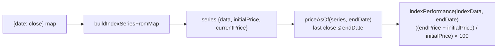

## Summary

Adds the pure data kernel that the #333 chart-vs-summary reconciliation needs:
deriving each benchmark index's performance over a **bounded window** (score
date → an explicit end date) instead of always running to the latest available
price. Closes #366

Two additions to `docs/market_index.js`, both pure (no DOM, no class state) and
published on `globalThis.GRQMarketIndex` so the browser dashboard and the Deno
tests share the **same** shipped logic:

- `priceAsOf(seriesOrPoints, endDate)` — returns the close of the latest point
  with `date <= endDate` ("last close ≤ endDate"), or `null` when nothing
  qualifies (empty/missing series, end date before all data, or an unparseable
  date). Accepts either a built series object (`{ data: [{date, close}] }`) or a
  bare `{date, close}` points array. Date comparison is at local midnight,
  matching how `buildIndexSeriesFromMap` slices the series.
- `indexPerformance(indexData, endDate)` — now takes an optional `endDate`. When
  supplied, the end price becomes window-aware via `priceAsOf(indexData.data,
  endDate)`; when omitted, behaviour is unchanged (runs to the latest close).
  `initialPrice` semantics are untouched (still the score-date baseline) and the
  `((endPrice - initialPrice) / initialPrice) * 100` formula is unchanged, so an
  end date on the latest data date reproduces the full-period result.

No DOM or app wiring is changed — that is the consuming #333 sub-issue. This
change is additive and green on its own.

## Why

`indexPerformance` previously read `currentPrice` (the latest price in the
window), and `docs/app.js` always set the window end to *today*, so the
"Market Performance Comparison" summary always ran to today — disagreeing with
the windowed dashboard chart (#333). There was no helper to read an index's
close at/just-before an arbitrary date; this kernel supplies it.

## Evidence

Backend/kernel-only change (pure JS helpers, no web interface altered), so no
screenshot applies. Verified by the unit tests below — all 17 tests in
`tests/market_index_test.ts` pass, and the full suite is green
(`deno test --allow-read tests/*.ts` → 602 passed, 0 failed).

## Test Plan

Added to `tests/market_index_test.ts`, driven by a synthetic `{date: close}`
map with a mid-window dip (the #333 shape), built through the real
`GRQProjection.buildIndexSeriesFromMap` (no test-only copy):

- `priceAsOf` — end date between two points → returns the earlier point's close
  (last ≤ endDate);
- `priceAsOf` — end date exactly on a point → that point's close;
- `priceAsOf` — end date before the first point → `null`;
- `priceAsOf` — end date on the last point → equals the full-period
  `currentPrice` (proves no regression);
- `priceAsOf` — accepts a bare `{date, close}` points array;
- `priceAsOf` — tolerant of empty/missing/unparseable inputs, never throws;
- `indexPerformance` — end date inside the dip yields a **lower** figure (−10%)
  than the latest (+10%) — the exact #333 disagreement;
- `indexPerformance` — end date on the last point equals the full-period result
  (regression-safe);
- `indexPerformance` — end date before all data → `null` (render blank);
- `indexPerformance` — omitting `endDate` preserves existing full-period
  behaviour.
