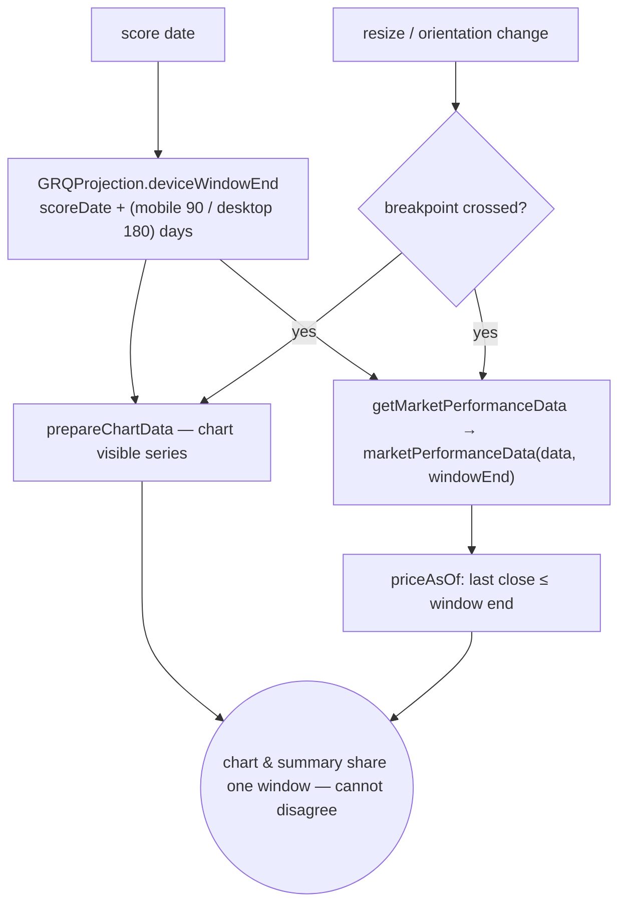

# Align Market Performance summary to the chart's per-device window

## Summary

The dashboard chart truncates its visible benchmark series to a per-device
window measured from the score date (mobile 90 days, desktop 180 days), but the
"Market Performance Comparison" summary ran to today's latest price. For a score
date sitting before a later recovery the two contradicted each other — the chart
showed an index **down** while the summary showed it **up**.

This change constrains the summary to the **same** window the chart plots, via a
single source of truth, so they can never disagree in direction. **Closes #367.**

What changed:

- **Single source of truth** — added `GRQProjection.deviceWindowDays(isMobile)`
  and `GRQProjection.deviceWindowEnd(scoreDate, isMobile)` (pure helpers). The
  90/180 value previously lived only inside `prepareChartData`; it now lives in
  one place that `prepareChartData`, `calculateCostOfCapitalData` (the chart) and
  `getMarketPerformanceData` (the summary) all consume, so they cannot drift.
- **Window-aware summary** — `GRQMarketIndex.marketPerformanceData` now accepts
  and forwards an `endDate`, so each index's end price is the last close at or
  before the window end (via the `priceAsOf` helper from the #366 kernel) instead
  of the latest price. `getMarketPerformanceData` passes
  `deviceWindowEnd(scoreDate, isMobile)`.
- **Runtime breakpoint change** — `syncChartForViewport` now detects a
  mobile/desktop crossing (resize / orientation change) and re-derives **both**
  the chart and the summary to the new window, so a desktop→mobile resize
  re-narrows the summary to 90 days and they stay in agreement.
- **Blank-on-missing preserved** — an index with no usable price in the window is
  omitted (rendered blank), never an error. No live fetch is introduced; figures
  still come only from the already-loaded local `this.marketIndexData`.



## Evidence

Playwright MCP was not available in this environment, so visual capture was not
possible. Instead the fix is demonstrated numerically against the **real shipped
kernel** (`docs/projection.js`, `docs/market_index.js`) and the **actual**
`docs/market-indices.json`, for the **1 Jan 2026** score date the issue cites:

```
score date: 2026-01-01
mobile window end : 2026-03-31 (scoreDate +90d)
desktop window end: 2026-06-28 (scoreDate +180d)

index        | OLD run-to-today | NEW mobile 90d | NEW desktop 180d
SP500        |           +9.36% |         -4.13% |           +9.36%
NASDAQ       |          +14.13% |         -6.00% |          +14.13%
Russell 2000 |          +18.80% |         +0.17% |          +18.80%
```

- The **OLD run-to-today** column reproduces the exact figures in the issue
  (SP500 +9.36%, NASDAQ +14.13%, Russell 2000 +18.80%) — the buggy "summary up
  while chart down" case.
- The **mobile 90d** window ends inside the early-2026 dip, so SP500 and NASDAQ
  now read **negative**, matching the sign of the chart's last visible point on
  mobile — the contradiction is gone.
- The **desktop 180d** window reaches the latest available data, so the chart and
  summary both run to ~today and agree there too.

## Test Plan

- Added `tests/chart_summary_window_test.ts` exercising the real shipped helpers:
  - `deviceWindowDays` → 90 (mobile) / 180 (desktop).
  - `deviceWindowEnd` → `scoreDate + days` at local midnight; null on an
    unparseable/missing score date (blank, never throws).
  - `marketPerformanceData(data, endDate)` end-to-end reconciliation reproducing
    the #333 shape (dip-then-recovery): mobile and desktop windows report the
    in-window sign, not the recovered latest price; an index with no price in the
    window renders blank.
- Extended the existing typed wrapper in `tests/market_index_test.ts` continues
  to pass (`marketPerformanceData` keeps its run-to-latest behaviour when no
  `endDate` is supplied — backward compatible).
- Full suite: `deno test --allow-read tests/*.ts` → **607 passed, 0 failed**.
  `deno fmt --check`, `deno lint`, `deno check` all clean.
