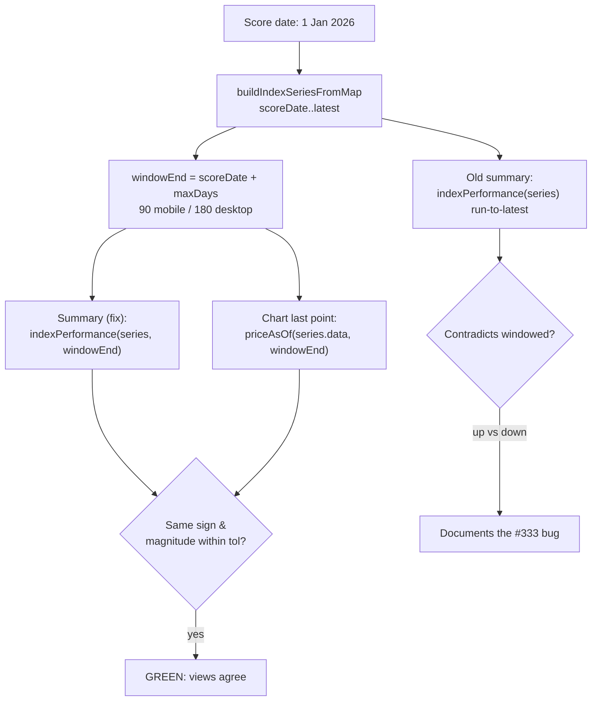

# TDD regression test: chart and summary must agree in direction (1 Jan 2026)

## Summary

Adds the failing-first (TDD) regression test for the #333 chart-vs-summary
direction contradiction at a **1 January 2026** score date. Closes #368.

With a 1 Jan 2026 score date the benchmark indices (SP500 / NASDAQ /
Russell 2000) disagreed between two views that share the same score-date
baseline and differ **only** in their end date:

- the **chart** is truncated to `scoreDate + maxDays`
  (`maxDays = isMobile ? 90 : 180`, `docs/app.js:1602`), so it stops inside the
  early-2026 dip and trends **down**;
- the **summary** ran `indexPerformance` over the full period to the latest
  price (`docs/market_index.js`, fed by `endDate = new Date()` at
  `docs/app.js:818`), so it read **up** (SP500 +9.36%, NASDAQ +14.13%,
  Russell 2000 +18.80%).

The new test (`tests/chart_summary_direction_consistency_test.ts`) reproduces
that contradiction with deterministic early-2026 fixture data and guards
against it. It drives the **real shipped kernels** — `docs/projection.js`
(`buildIndexSeriesFromMap`, `setDateToMidnight`) and `docs/market_index.js`
(`indexPerformance`, `priceAsOf`) — exactly as `docs/app.js` does, with **no
re-implemented maths** and no network / no dependency on "today".

The assertion is expressed against the **shared window end the fix introduces**
(`scoreDate + maxDays`), so it is:

- **RED against current `main`**, where `indexPerformance` has no window-aware
  end date and `priceAsOf` does not exist — the summary still reads to the
  latest price and disagrees in sign with the windowed chart (verified: against
  `main`'s kernels the test fails with `GRQMarketIndex.priceAsOf is not a
  function`);
- **GREEN on the `milestone/333-…` branch**, where the #333 kernel landed and
  the summary can be constrained to the chart window.

> **Dependency note:** this is the TDD red test for #333. It is authored first
> and lands green with/after the kernel + wiring sub-issues — never merge a red
> test alone. On the milestone branch the window-aware kernel is present, so the
> test passes here.

## Test flow

## Evidence

Backend / test-only change (no web UI altered), so no screenshot. Evidence is
the test run itself:

- **Green on this milestone branch:** `deno test` →
  `2 passed (8 steps) | 0 failed`; full suite `604 passed | 0 failed`.
- **Red against `main`:** running the same test against `main`'s
  `docs/market_index.js` / `docs/projection.js` fails with
  `TypeError: GRQMarketIndex.priceAsOf is not a function`, confirming the
  failing-first TDD behaviour.

## Test Plan

- Added `tests/chart_summary_direction_consistency_test.ts`:
  - `chart and summary agree in direction at the shared per-device window end
    (#368)` — for both the **mobile (90-day)** and **desktop (180-day)**
    windows, and each of SP500 / NASDAQ / Russell 2000, asserts the windowed
    summary and the chart's last-visible-point change share the same sign and
    agree in magnitude within tolerance; asserts both read **down** in-window;
    and asserts the old run-to-latest summary reads **up**, documenting the
    contradiction the shared window end removes.
  - `fixture reproduces the #333 full-period summary numbers` — pins the
    full-period figures to the reported numbers (SP500 +9.36%, NASDAQ +14.13%,
    Russell 2000 +18.80%) so the fixture stays faithful to the report.
