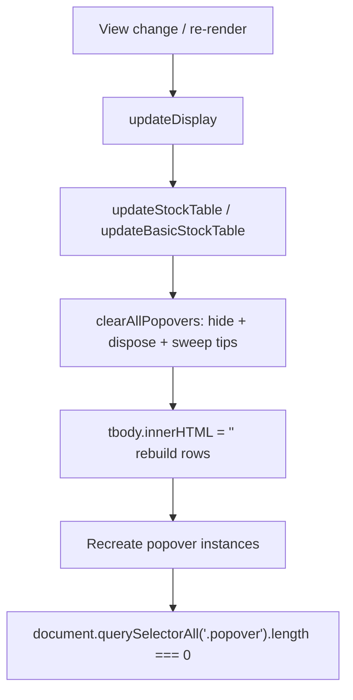

# Auto-dismiss/sweep value popovers on every re-render (Issue #370)

## Summary

On a ~375px mobile viewport, opening a value popover (e.g. **Portfolio
Target**) and then selecting a single stock left the popover stuck on screen
with no way to close it. Every `.clickable-value` popover is created with
`container: "body"`, so its visible tip is appended to `<body>`. A re-render
replaces the table via `tbody.innerHTML = ""`, destroying the trigger ``
but **orphaning** the tip on `<body>`; the old dispose loop iterated only the
current triggers, so it could never dispose the orphaned instance and the tip
stayed visible forever.

The fix adds a shared, pure helper
`clearAllPopovers(document, bootstrap.Popover)` in `docs/popover_cleanup.js`
(published as `globalThis.GRQPopovers`) that:

1. hides **then** disposes every live popover instance attached to a trigger, and
2. sweeps any stray `.popover` tips off the document
   (`querySelectorAll('.popover').forEach((n) => n.remove())`) — the orphaned
   tip has no live trigger, so disposing by trigger alone cannot remove it.

It is invoked at the start of both `updateStockTable()` and
`updateBasicStockTable()` (before `tbody.innerHTML = ""`) and replaces the
previous trigger-only dispose loop in `updateStockTable()`. Because every view
change / re-render routes through `updateDisplay()` → one of those two table
methods, single-stock selection, score-file switching, basic ↔ market view and
back-to-aggregate all now start from a clean popover state.

Closes #370.

## Evidence

Playwright MCP / a headless browser was not available in this environment, and
this is a Deno repo (adding Node browser tooling would be a regression), so the
behaviour is verified by automated tests that exercise the **real shipped
helper** against a DOM mock, plus a recorded manual procedure in
`docs/fixes/POPOVER_AUTO_DISMISS_FIX.md`.

Acceptance criteria mapped to tests in `tests/popover_cleanup_test.ts`:

- Orphaned tip with no live trigger is swept → `.popover` count is `0`
  (`clearAllPopovers sweeps an orphaned tip with no live trigger`).
- Mixed open + orphan state leaves no `.popover`
  (`clearAllPopovers leaves no .popover after a mixed open+orphan state`).
- Live popovers are hidden **before** disposal
  (`clearAllPopovers hides then disposes every live popover`).

## Test Plan

- Added `tests/popover_cleanup_test.ts` (7 tests) covering: hide-before-dispose
  ordering, sweeping the orphaned-tip bug, the mixed open+orphan case,
  no-instance triggers, invalid/missing document, and a missing Popover API.
- `deno test --allow-read tests/*.ts` → 599 passed, 0 failed.
- `tests/js_syntax_test.ts` confirms `docs/app.js` still parses cleanly after
  the wiring change.
- `tests/sw_precache_list_test.ts` passes with `popover_cleanup.js` added to
  the service-worker precache list.
