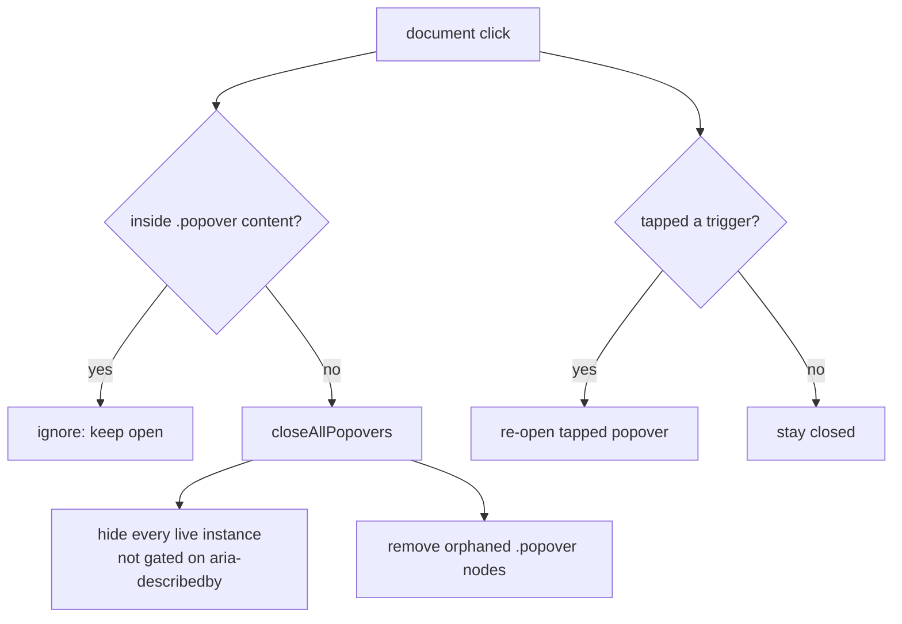

## Summary

"Tap outside to close" was unreliable for the dashboard's mobile value
popovers. `docs/app.js` carried **two** competing global `document` click
handlers (one in `initializeEventListeners()`, one at module load) with
overlapping logic. Both closed popovers by iterating the live **triggers**
(`.clickable-value` / `[data-bs-toggle="popover"]`) and calling `hide()`
**only if the trigger still had `aria-describedby`**. An **orphaned tip** — a
`.popover` node left on `<body>` after a re-render disposed its trigger — has
no live trigger, so neither handler could reach it and tapping outside did
nothing.

This PR consolidates the two handlers into a **single** global click handler
backed by a new shared, tested module `docs/popover_dismiss.js`
(`GRQPopover`). The new dismissal path hides **every** live Bootstrap instance
(no longer gated on `aria-describedby`) **and** removes any leftover `.popover`
nodes from the DOM, so orphaned tips are dismissed too. Tapping inside popover
content still does nothing; tapping a trigger still closes the others and
re-opens the tapped one.

Closes #371.

## Changes

- **`docs/popover_dismiss.js`** (new) — pure, dependency-injected `GRQPopover`
  helpers published on `globalThis`, mirroring `escape.js` / `color_key.js`:
  - `decidePopoverAction({ insidePopover, hasTrigger })` → `"ignore"` /
    `"closeAndReopen"` / `"closeOnly"`.
  - `closeAllPopovers(doc, getInstance)` → hides every live instance and
    removes orphaned `.popover` nodes; returns `{ hidden, removed }`.
- **`docs/app.js`** — replaced handler #1 with the single consolidated handler
  using `GRQPopover`; removed handler #2 (left a breadcrumb comment). Exactly
  one global popover click handler now remains.
- **`docs/index.html`** — loads `popover_dismiss.js` before `app.js`.
- **`tests/popover_dismiss_test.ts`** (new) — exercises the real shipped logic.

## Evidence

This is a small front-end behaviour change in vanilla JS with no JS test
harness for `docs/app.js` itself (noted in the issue). The dismissal decision
and the orphan-removal logic were extracted into `docs/popover_dismiss.js` so
the **real shipped code** is unit-tested rather than a copy. Playwright MCP was
not available in this run, so no live screenshot was captured; the behaviour is
pinned by the unit tests below and was reasoned through against the acceptance
criteria.

Acceptance criteria mapping:

- *Open any popover, tap outside → it closes* — `closeOnly` path runs
  `closeAllPopovers`, which hides every live instance.
- *Orphaned tip still removed* — `closeAllPopovers` removes leftover `.popover`
  nodes even with no live trigger (test: "removes orphaned tips that have no
  live trigger").
- *Tapping inside the popover does not close it* — `decidePopoverAction`
  returns `"ignore"` (test: "tapping inside popover content is ignored").
- *Exactly one global popover click handler remains* — handler #2 removed; a
  single `document.addEventListener("click", …)` remains in `docs/app.js`.

## Test Plan

- `tests/popover_dismiss_test.ts` (new):
  - publishes helpers on `globalThis`;
  - `decidePopoverAction` for inside-popover / trigger / outside taps;
  - `closeAllPopovers` hides every live instance regardless of
    `aria-describedby`;
  - `closeAllPopovers` removes orphaned tips with no live trigger (core #371
    bug);
  - hides live instances **and** removes orphans together;
  - safe no-op when nothing is open; tolerates a trigger with no instance;
  - the module parses cleanly via `checkJsSyntax`.
- `tests/js_syntax_test.ts` continues to confirm `docs/app.js` parses cleanly.
- Full Deno suite (`deno test --allow-read tests/*.ts`) passes.
