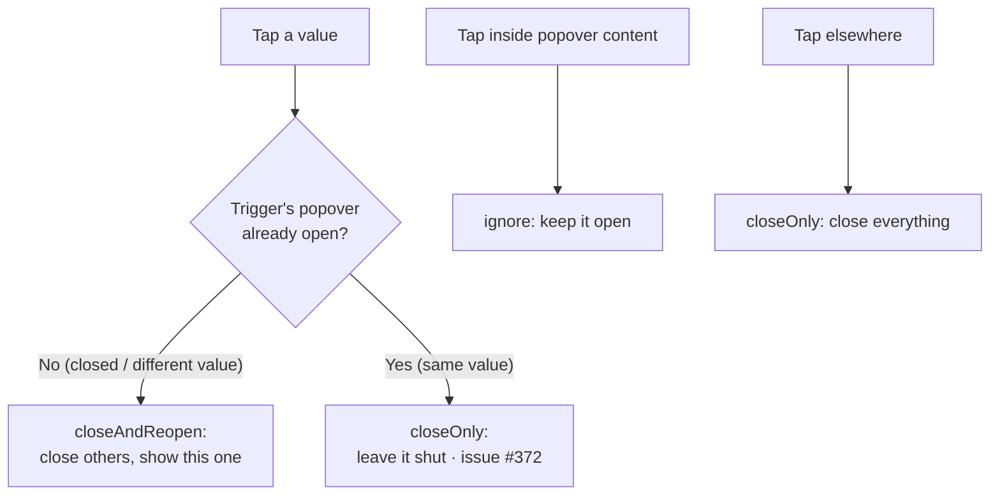

# Toggle a value popover shut on a second tap (mobile)

## Summary

On mobile, tapping a `.clickable-value` opened its popover, but tapping the
**same** value again re-opened it — there was no way to dismiss a popover by
tapping its own trigger. The consolidated global click handler
(`docs/app.js`) always re-showed the tapped trigger after closing all
popovers.

The fix makes the trigger tap **toggle**:

- `docs/app.js` now captures whether the tapped trigger's popover is already
  open **before** the close-all loop runs. Bootstrap sets `aria-describedby`
  on a trigger while its popover is shown, so `trigger.hasAttribute(
  "aria-describedby")` is a reliable "already open" signal.
- `docs/popover_dismiss.js`'s `decidePopoverAction()` accepts a new
  `triggerAlreadyOpen` flag. When a trigger is tapped and its popover was
  already open it returns `"closeOnly"` (toggle shut); otherwise it returns
  `"closeAndReopen"` as before. The flag defaults to `false`, so any existing
  caller keeps the original behaviour.

This applies to every `.clickable-value` popover, not only Portfolio Target.

Closes #372.

## Behaviour

## Evidence

Playwright MCP was unavailable in this run, so no live screenshot could be
captured. The change is driven entirely by the pure, dependency-injected
`decidePopoverAction()` helper, which is exercised directly by unit tests:

- Tapping the **same** already-open trigger → `closeOnly` (toggles shut).
- Tapping a **different** (closed) trigger → `closeAndReopen` (unchanged).
- Tapping inside popover content still wins (`ignore`), even over an open
  trigger.
- Tapping outside still closes everything (`closeOnly`).

The `docs/app.js` wrapper is a thin shim that reads `aria-describedby` and
forwards the flag, matching the manual acceptance criteria at ~375px:

- Tap a value → opens; tap the same value again → closes.
- Tap a different value → first closes, second opens.

Full `./quality.sh` passes cleanly (Rust + 612 Deno tests).

## Test Plan

Added to `tests/popover_dismiss_test.ts` (existing tests unchanged):

- `decidePopoverAction - tapping the SAME already-open trigger toggles it shut (issue #372)`
- `decidePopoverAction - tapping a DIFFERENT (closed) trigger still closes others then reopens it (issue #372)`
- `decidePopoverAction - tapping inside content wins even over an already-open trigger (issue #372)`

All 13 tests in the file pass; the full Deno suite (612 tests) is green.
