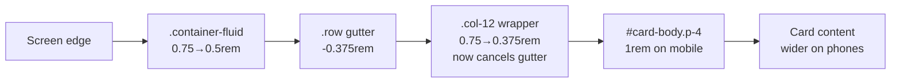

## Summary

Reclaims the app-wide horizontal margins so dashboard content uses more of the
available screen width, responsively and consistently across breakpoints.
Closes #382 (sub-issue of #337 — _Use more of the screen width_).

The inset from the screen edge to actual card content was the **sum of several
stacked horizontal paddings**: `.container-fluid` side padding, the `.row` /
column gutters, the outer `.col-12` page wrapper, and `#card-body.p-4`. The
prior mobile work (#315/#316/#317) tightened the row gutters and the inner
columns (`.col, .col-md-6, .col-lg-4`) but **missed the outer `.col-12`
wrapper** (`docs/index.html:108`), so it kept Bootstrap's full `0.75rem` padding
on phones and still contributed to the double-wide margin.

Changes (CSS only — no HTML/markup change, no Node tooling):

- **Mobile (`max-width: 768px`)** — trim the stacked outer side padding:
  - `.container-fluid` side padding reduced `0.75rem → 0.5rem`.
  - `.col-12` added to the existing tightened column rule so its padding drops
    `0.75rem → 0.375rem`, cancelling the `-0.375rem` row gutter so content
    aligns with the container edge instead of indenting further. This extends
    the #316 rule rather than re-fighting it.
- **Wide desktop** — `.container-fluid` gains `max-width: 1600px` with `margin:
  auto`, so genuinely wide monitors keep a comfortable, centred reading width
  instead of going edge-to-edge full-bleed. The cap only binds above ~1600px,
  so 1440px-class desktops, tablets and phones stay fluid and unchanged.

### Deno regression avoided

- Implemented as pure CSS in `docs/styles.css`; no Node tooling, bundler, or
  `package.json` introduced (this is a Deno repo). Verified with `deno fmt`,
  `deno lint`, `deno check`, `deno test`.

## Evidence

Screenshots captured with headless Chrome against the static `docs/` site at
375 / 768 / 1440 / 1920px in light and dark themes.

**Mobile 375px — before vs after (light):** content reclaims the over-wide side
margin; no new clipping (the header-title overflow is pre-existing #315 banner
behaviour, present in both, and out of scope here).

| Before | After |
| --- | --- |
|  |  |

**Mobile 375px (dark):**

**Tablet 768px (light) — no regression:**

**Desktop 1440px (light & dark) — no regression, layout unchanged:**

**Wide 1920px (light) — content capped at 1600px and centred (comfortable
max-width, not full-bleed):**

### Where the margin is reclaimed

## Test Plan

- Added `tests/dashboard_horizontal_margins_test.ts` (TDD — failing first, then
  passing), pinning the responsive CSS behaviour the same way the existing
  `dashboard_section_spacing_mobile_test.ts` does:
  - mobile `.container-fluid` side padding is trimmed below Bootstrap's
    `0.75rem`;
  - mobile `.col-12` page-wrapper padding is tightened to `0.375rem` (matching
    the `-0.375rem` row gutter);
  - `.container-fluid` declares a comfortable px max-width (`>= 1440` so 1440px
    is not regressed, `<= 2000` so wide monitors are capped) and is centred;
  - the max-width cap is not trapped inside the phone-only media block.
- Full Deno suite passes (`deno test --allow-read tests/*.ts`), including the
  existing `dashboard_section_spacing_mobile_test.ts`,
  `dashboard_card_chrome_mobile_test.ts` and `header_banner_mobile_test.ts`
  (no regressions).
- `./quality.sh` run clean (Rust gate untouched — change is frontend CSS only).
