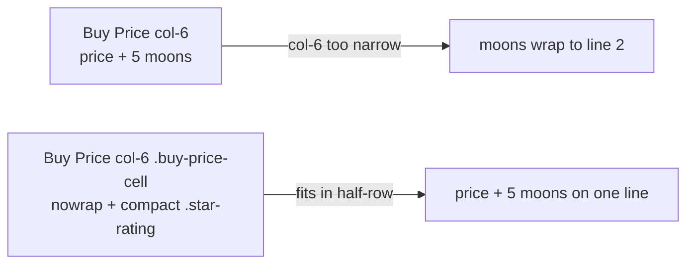

# Mobile: keep Buy Price + full 5-moon rating on one line in the detail panel

## Summary

In the "Detailed Information" panel the Buy Price **value** and its moon rating
shared a single `col-6` cell, so on a ~375px phone `$XX.XX 🌕🌕🌕🌕🌕` wrapped
onto a second line under the price. This fix keeps the price and its full
(up to 5) moon rating on **one line** at 375px without clipping or overflow,
while staying responsive and unchanged in look at 768px and ≥1440px.

The change is pure CSS + a markup hook — no behaviour change to the rating
itself, which still comes from the same `getStarRatingDisplay()` used by the
"Individual Stock Performance" table:

- `docs/app.js` — the Buy Price value `col-6` now carries a `buy-price-cell`
  class, and the rating span carries a `star-rating` class.
- `docs/styles.css` — `#stockDetailCard .buy-price-cell` is pinned to
  `white-space: nowrap` so the run never breaks between the price and the
  moons, and `#stockDetailCard .buy-price-cell .star-rating` renders the moons
  compactly (`font-size: 0.85em; letter-spacing: -0.08em`) so even a worst-case
  4-digit price plus 5 moons fit within the half-row cell.

The rules apply at all viewports (harmless at larger sizes where there is ample
room), keeping the panel consistent across breakpoints. The Stars and Buy Price
popover click targets are untouched.

Closes #383.

## Evidence

Captured with headless Chrome, loading the real `docs/styles.css` and the exact
detail-panel markup inside fixed-width iframes (so the `≤768px` media queries
respond to the true viewport width). The worst-case 4-digit price `$1,234.56`
plus all 5 moons is used to stress the layout.

**Before — at 375px the rating wraps onto a second line:**

**After — one line at 375 / 768 / 1440px (light theme):**

**After — one line at 375 / 768 / 1440px (dark theme):**

## Test Plan

Added `tests/buy_price_one_line_detail_test.ts` (TDD — written failing first,
then made to pass), following the repo's established CSS/markup-reading
convention (see `dashboard_section_spacing_mobile_test.ts`):

- `app.js`: the Buy Price value `col-6` carries the `buy-price-cell` hook.
- `app.js`: the detail-panel stars span carries the `star-rating` hook.
- `styles.css`: `#stockDetailCard .buy-price-cell` sets `white-space: nowrap`.
- `styles.css`: `#stockDetailCard .buy-price-cell .star-rating` compacts the
  glyphs (`font-size < 1em`, negative `letter-spacing`).
- `app.js`: the detail panel and table both source the rating from
  `getStarRatingDisplay(stock.stock)` (consistency, per acceptance).

Full suite: `deno test --allow-read tests/*.ts` → **638 passed, 0 failed**.
`deno fmt --check`, `deno lint`, and `deno check` all clean. The change touches
only `docs/` JS/CSS and Deno tests — no Rust sources are affected.
