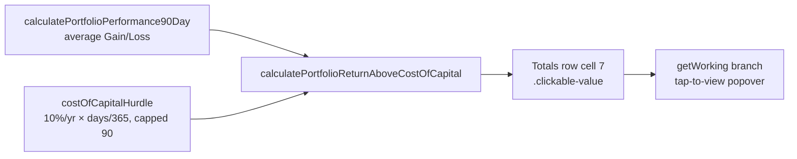

# feat: portfolio Return above Cost of Capital total + tap-to-view popover

## Summary

Adds a true **portfolio Return above Cost of Capital** to the aggregate
dashboard's totals (footer) row, rendered in the 7th cell under the existing
**Return above Cost of Capital** header, with a tap-to-view popover that shows
the full working. Closes #407.

Previously no portfolio-level Return above Cost of Capital was computed. The new
total is:

**Portfolio Return above Cost of Capital = average Gain/Loss − shared cost-of-capital hurdle**

- Average Gain/Loss = `calculatePortfolioPerformance90Day()` (equal-weighted
  mean of each priceable stock's 90-day Gain/Loss; unpriceable stocks excluded
  and re-weighted over the remainder, #289).
- Hurdle = `(costOfCapital / 365) × daysElapsed`, where `daysElapsed` comes from
  `getDaysElapsedFromMarketData(scoreDate)` (capped at 90 ≈ 2.5%). This is the
  **same single hurdle** used per-stock, so the total equals the mean of the
  per-stock values shown in that column.

### What changed

1. **`docs/projection.js`** — two small pure helpers as the single source of
   truth for the hurdle maths: `costOfCapitalHurdle(costOfCapital, daysElapsed)`
   and `returnAboveCostOfCapital(performance, costOfCapital, daysElapsed)`.
2. **`docs/app.js`**
   - `calculateProgressVsCostOfCapitalValue` now delegates to the shared
     `returnAboveCostOfCapital` helper (no behaviour change) so the per-stock
     column and the new portfolio total use one hurdle definition.
   - New `calculatePortfolioReturnAboveCostOfCapital()` = average Gain/Loss −
     shared hurdle, reusing the existing pieces.
   - Totals row's 7th cell renders the value as a `.clickable-value` span with
     `data-field="portfolio-return-above-cost-of-capital"` `data-stock=""`,
     coloured via `getPerformanceClass(...)`, mirroring the `portfolio-target`
     totals cell.
   - New `getWorking` branch renders the working: the formula, each included
     stock's Gain/Loss, the shared hurdle (10%/yr pro-rated by market-data days,
     capped at 90) and its value, and the resulting portfolio total.

The popover is registered automatically by the existing `.clickable-value`
sweep in `updateStockTable` and disposed by `clearAllPopovers`, inheriting the
dismissal behaviour from #370/#371/#372 — no separate handler, no inline JS
(CSP-clean, #268).

## Evidence

Aggregate totals row — the new **Return above Cost of Capital** total (1.6%)
sits in the 7th column: average Gain/Loss 4.0% − hurdle 2.4% = 1.6%, equal to
the mean of the per-stock column above it.

Tap-to-view popover showing the full working (per-stock Gain/Loss list, average
Gain/Loss, the shared hurdle pro-rated over 86 market-data days, and the
`4.0% − 2.4% = 1.6%` total):

## Test Plan

New `tests/portfolio_return_above_cost_of_capital_test.ts` (7 tests) drives the
real shipped helpers and parses the actual shipped markup:

- `costOfCapitalHurdle` — 10%/yr over 90 days ≈ 2.5%; zero days → 0%.
- `returnAboveCostOfCapital` — equals average Gain/Loss − hurdle for a known
  fixture; equals the mean of the per-stock figures; null performance → null.
- Markup: the `portfolio-return-above-cost-of-capital` totals cell aligns with
  the **Return above Cost of Capital** header column, and is a CSP-clean
  `.clickable-value` popover trigger with `data-stock=""` and no inline JS.

All Deno tests pass (`649 passed`) and the full `./quality.sh` gate passes
cleanly (exit 0). Change is frontend-only; no Rust code was touched.
