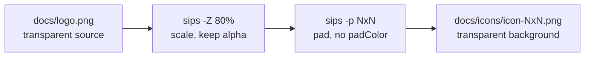

## Summary

Regenerated the full favicon / PWA app-icon set in `docs/icons/` from
`docs/logo.png` with a **fully transparent background**, replacing the solid
periwinkle-blue (`#667eea`) square that was previously baked into every PNG. The
robot mascot artwork is unchanged — same ~80% safe-area scale used by the
original set (issue #221) — only the background pixels became transparent, so
the icons now match the genuinely transparent `docs/logo.png`. Closes #419.

All twelve sizes were regenerated (16, 32, 72, 96, 128, 144, 152, 167, 180, 192,
384, 512), covering the browser-tab favicons, the iOS apple-touch icons, the
Android / installed-PWA manifest icons, and the Windows-tile icons.

No markup or brand colours changed: the HTML `<head>` links, `manifest.json`
(`purpose: "any maskable"`, `theme_color`/`background_color` `#667eea`), and
`browserconfig.xml` (`TileColor #667eea`) are untouched, as required by the
accepted scope. The `#667eea` Windows `TileColor` still supplies a blue tile
background by design.

A reproducible generator, `scripts/generate_icons.sh`, was added. It uses macOS
`sips` only — scale the largest edge to 80% of the target, then pad onto an N×N
square with **no `--padColor`** so the padding inherits the source's alpha
channel and becomes transparent. No Node tooling was introduced; this stays a
Deno/Rust repo.

## Evidence

Before (left, solid `#667eea` square) vs after (right, transparent — shown on a
checkerboard so the transparency is visible), 192×192 icon:

> Playwright MCP was not available in this environment, so the evidence image was
> composited directly from the committed `before`/`after` PNGs (HEAD vs working
> tree) onto a checkerboard. Transparency was independently verified by the new
> automated tests below, which decode each PNG and assert the corner pixels have
> alpha 0.

## Test Plan

Extended `tests/pwa_icons_test.ts` (runs under `deno test --allow-read tests/*.ts`,
no external dependencies):

- Added a minimal pure-Deno PNG decoder (8-bit, non-interlaced, colour type 6)
  using the platform `DecompressionStream("deflate")` to inflate IDAT and
  reverse the per-row PNG filters.
- `pwa icons - corners are fully transparent` — decodes every icon and asserts
  all four corner pixels have alpha 0. This fails against the old opaque set
  (corners were `#667eea` at alpha 255) and passes after regeneration —
  the regression guard for #419.
- `pwa icons - robot artwork remains (centre is opaque)` — guards the opposite
  regression (a blank/all-transparent image) by asserting the centre pixel is
  opaque.
- Existing checks (file exists, PNG magic bytes, pixel dimensions) retained
  unchanged.

Results: `tests/pwa_icons_test.ts` 5 passed; full Deno suite 651 passed, 0 failed.

### Deno regression avoided

Regenerated icons with macOS `sips` and verified transparency with a
dependency-free pure-Deno PNG decoder, rather than reaching for a Node image
library or icon generator.
