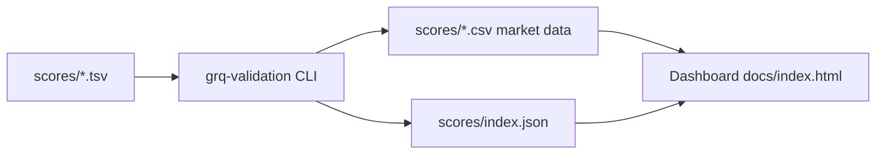

## Summary

Updated `README.md` and `docs/README.md` to match the current state of the
repository, and added a Deno test suite that guards documentation accuracy so
future drift is caught automatically. Closes #42.

Concrete fixes:

- Replaced stale workflow references (`rust.yml`, `deploy.yml`,
  `dependencies.yml`) with the nine workflows that actually live in
  `.github/workflows/` (`ci.yml`, `cargo-audit.yml`, `deno-outdated.yml`,
  `deno-quality.yml`, `dependency-review.yml`, `gitleaks.yml`,
  `markdown-lint.yml`, `semgrep.yml`, `shellcheck.yml`).
- Corrected the recent-files window from "within 180 days" to "within 100
  days" to match `run.sh`.
- Replaced the `[Add your license information here]` placeholder with a
  proper Apache 2.0 reference that matches the `LICENSE` file.
- Documented the `--performance-only` CLI flag that `src/main.rs` exposes.
- Added `helpers/` and `scripts/` to the project structure section and
  mentioned `quality.sh`.
- Added a Mermaid architecture diagram showing the data flow from score
  files through the CLI to the dashboard.
- Removed stray `# Test comment` / `# Another test comment` lines from
  `docs/README.md`.

## Evidence

This is a documentation-only change with no UI surface to screenshot. The new
test suite `tests/documentation_accuracy_test.ts` reads the actual files and
asserts on their content, so the fixes are verifiable by running the tests.

```text
$ deno test --allow-read tests/documentation_accuracy_test.ts
ok | 9 passed | 0 failed
```



## Test Plan

- Added `tests/documentation_accuracy_test.ts` with 9 tests covering:
  - No references to removed workflows.
  - All present workflow files referenced.
  - Licence placeholder removed and Apache 2.0 documented.
  - Correct recent-files window (100 days, not 180).
  - `helpers/` and `scripts/` documented in project structure.
  - Every CLI flag from `src/main.rs` documented.
  - No stray test comments in `docs/README.md`.
  - Australian English spot-checks.
- Confirmed `cargo test --all-targets` still passes (25/1/1 tests).
- Confirmed `markdownlint-cli2` passes on the updated Markdown files.

Two unrelated pre-existing test failures remain in
`tests/schw_projection_test.ts` (R-squared assertion against market data) and
`tests/markdown_lint_workflow_test.ts` (requires `--allow-run` to invoke
`npx`). Both fail identically on `main` without these documentation changes.
