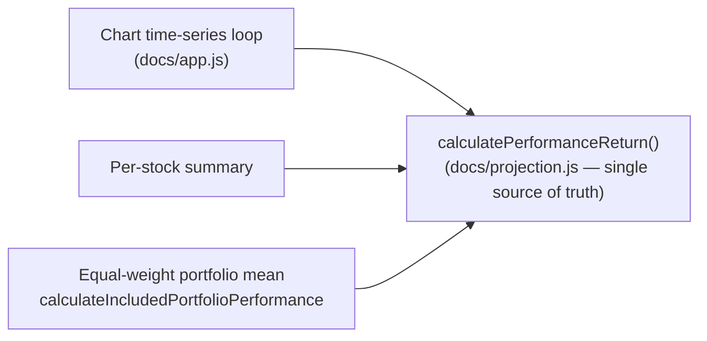

## Summary

Centralised the "Performance Over Time" chart's actual-performance + dividend
maths onto the shared `GRQProjection.calculatePerformanceReturn()` kernel. The
chart time-series loop in `docs/app.js` previously **inlined** the identical
price-return / dividend-return / total-return formula already implemented by the
shared helper that the per-stock summary and the equal-weight portfolio mean
(`calculateIncludedPortfolioPerformance`) use. Two copies of the same formula can
drift, so the chart now delegates to the single shared implementation — the
chart, the summary and the per-stock views can never disagree. This is a
behaviour-preserving refactor (the numbers are unchanged); it pins the
behaviour to one source of truth. Closes #424.

Item (1) of #420. Frontend-only, in `docs/` (Deno repo — no Node tooling).

### Change
- `docs/app.js` (chart loop, ~line 2360): removed the inlined
  `priceReturn` / `dividendReturn` / `totalReturn` block and replaced it with
  `GRQProjection.calculatePerformanceReturn(buyPrice, currentPrice, totalDividends)`.
  The helper's `null` guard (`buyPrice <= 0`) is honoured the same way the
  summary path does — a stock returning `null` is dropped from the equal-weight
  average rather than counted as 0%. The existing equal-weight averaging
  (`totalPerformance / validStocks`) and the 90-day dividend filtering are
  unchanged.

## Evidence

Backend/maths refactor with no visual change (a refactor that preserves the
chart numbers). Verified by the Deno test suite anchored on the issue's
**ABC/XYZ** worked example:

- ABC: buy $1, current $1, dividends $0.01 → dividend return **1.0%**.
- XYZ: buy $20, current $20, dividends $0.05 → dividend return **0.25%**.
- ABC's dividend return is **4×** XYZ's for an equal-dollar buy.
- Equal-weighted portfolio dividend return = (1.0% + 0.25%) / 2 = **0.625%**, and
  the chart point equals `calculateIncludedPortfolioPerformance` for the same
  inputs — any future divergence between the chart loop and the shared kernel
  fails the suite.

`./quality.sh` (deno lint + deno test + Rust suite) passes cleanly.

## Test Plan

- Extended `tests/chart_data_test.ts` with `Chart actual-performance maths
  (issue #424)`, which:
  - asserts ABC = 1.0% and XYZ = 0.25% via the shared kernel,
  - asserts ABC is 4× XYZ,
  - models the chart's per-point equal-weight portfolio loop and asserts it
    equals both 0.625% and `calculateIncludedPortfolioPerformance` for the same
    inputs (call-equivalence guard),
  - asserts the chart point honours the `null` guard (a zero-buy stock is
    excluded from the mean, not counted as 0%).
- `deno test tests/chart_data_test.ts` and full `./quality.sh` pass.
