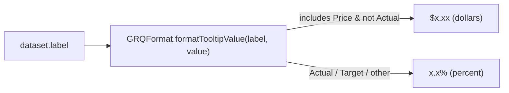

# Rename blue chart series "Performance" → "Actual" (keep yellow "Target")

## Summary

Item (2) of #420. The blue chart series is the **actual** portfolio/stock
performance; the AI prediction (yellow dot on the right axis) is the **Target**.
This renames the blue series label from **"Performance"** to **"Actual"** so the
legend and tooltip read correctly. The Target (yellow) series and its value are
unchanged.

Changes:

- Renamed the four blue-series labels in `docs/app.js`:
  `"Performance"` → `"Actual"` and `"Performance (After 90 Days)"` →
  `"Actual (After 90 Days)"` (single-stock and portfolio views).
- Moved the tooltip **unit-selection** logic into the shared `GRQFormat`
  module (`docs/format.js`) as `formatTooltipValue(label, value)`, mirroring the
  repo's existing pattern (`formatPercent`, `formatIndexLevel`, etc.) where pure
  logic is published on `globalThis` and shared by the browser and the Deno
  tests. The dormant tooltip branch in `app.js` previously formatted "Actual" as
  **dollars** (`$x.xx`); the blue series is a **percentage** (the left axis is
  "Performance (%)", values are `(price − buy) / buy × 100`). The shared helper
  keeps "Actual"/"Target" as percentages, so there is **no regression** from the
  old "Performance" tooltip path.
- Updated the price guard from `!label.includes("Performance")` to
  `!label.includes("Actual")` so the renamed blue series is never misread as a
  dollar value (the guard is only reachable by genuine `…Price` labels).

Frontend-only, in `docs/`. Independent of the other #420 sub-issues.

Closes #425.

## Evidence

Chart legend after the rename — blue series reads **"Actual"**, yellow still
reads **"Target"** (headless-Chrome render of the live dashboard at
`docs/index.html`):

Full dashboard render:

Playwright MCP browser tools were not available in this run; the screenshots
were captured with headless Chrome against a local static server of `docs/`.

## Test Plan

Added behavioural unit tests for the real shared helper in
`tests/format_test.ts` (imports `docs/format.js`, exercises
`GRQFormat.formatTooltipValue`):

- `formatTooltipValue renders the renamed Actual series as a percentage` —
  `"Actual"` and `"Actual (After 90 Days)"` → `…%` (regression guard for the old
  "Performance" path).
- `formatTooltipValue renders the Target series as a percentage`.
- `formatTooltipValue renders a genuine price series as dollars`.
- `formatTooltipValue price guard excludes the Actual series` — an
  `"Actual Price"` label stays a percentage.
- `formatTooltipValue treats other series as percentages`.
- `formatTooltipValue is defensive against non-finite values`.

All Deno tests pass (`deno test --allow-read tests/*.ts`: 657 passed, 0 failed),
plus `deno lint`, `deno fmt --check`, and `deno check`.
