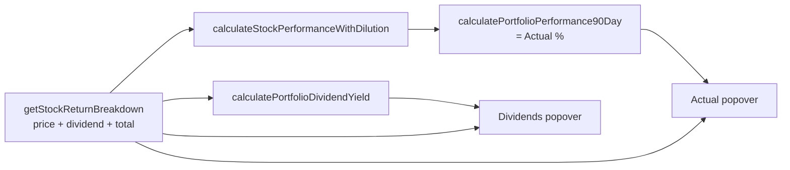

# Show-the-working popovers for Dividends and Actual (Issue #426)

## Summary

Added two tap-to-view "show-the-working" popovers to the aggregate-view totals
row, mirroring the existing **Portfolio Target working** popover so every
actual-performance number is visible and verifiable. Closes #426.

- **Actual popover** (Gain/Loss column totals cell): lists each included stock's
  `price return % + dividend return % = total return %`, then the
  equal-weighted average broken into `avg price + avg dividend = Actual %`. The
  total equals the displayed Actual figure and the chart's latest blue
  ("Performance") point.
- **Dividends popover** (Dividends column totals cell — previously `-`): lists
  each included stock's `buy price, 90-day dividends → yield %`, then the
  equal-weighted portfolio dividend yield. This makes the ABC-vs-XYZ yield ratio
  legible.

Both popovers and the displayed totals are built from a **single shared
decomposition** so they can never disagree with the plotted/summarised value:

- New `docs/projection.js` helpers `dividendReturnPercent()` and
  `calculateIncludedPortfolioDividendYield()` (the dividend slice of the
  Actual figure).
- New `getStockReturnBreakdown()` in `docs/app.js` is now the single source of
  truth for a stock's price/dividend/total return; `calculateStockPerformanceWithDilution()`
  delegates to it, and the new `calculatePortfolioDividendYield()` and both
  popover builders reuse it.

Because `Actual = average price return + average dividend return` and the
Dividends total **is** the average dividend return, the two popovers reconcile
exactly with each other and with the totals row.

## Evidence

Dividends popover (per-stock buy price, dividends, yield → equal-weighted total
0.23% over 19 stocks):

Actual popover (per-stock price + dividend = total return → Actual 3.7% + 0.23%
= 4.0%, matching the totals-row Gain/Loss cell and the chart's blue point):

Reconciliation verified live: totals row shows Gain/Loss **4.0%** and Dividends
**0.23%**; the Actual popover resolves to **3.7% + 0.23% = 4.0%** and the
Dividends popover to **0.23%**.

## Test Plan

New `tests/portfolio_actual_dividends_popover_test.ts` (13 tests), following the
two-layer pattern of `portfolio_return_above_cost_of_capital_test.ts`:

- **Pure helpers** (`docs/projection.js`): `dividendReturnPercent` happy/zero/
  null-buy-price paths and the ABC-vs-XYZ 4× ratio;
  `calculateIncludedPortfolioDividendYield` equal-weighted mean, excluded-stock
  reweighting, and the no-included-stocks → null guard.
- **Reconciliation**: `Actual = average price return + dividend component`, and
  `Actual = mean of per-stock total returns`.
- **Shipped markup** (`docs/app.js`): the `portfolio-actual` and
  `portfolio-dividends` totals cells are CSP-clean `.clickable-value` popover
  triggers (no inline handlers, `data-stock=""`), sit under the correct
  Gain/Loss and Dividends headers, and are routed through `getWorking(field, "")`
  as portfolio totals.

`deno test --allow-read tests/*.ts` → **665 passed, 0 failed**. `deno lint`,
`deno fmt --check`, and `deno check` pass.
