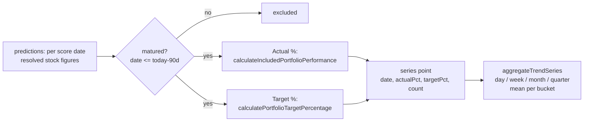

# Trend data engine: matured Actual % / Target % time series + aggregation

## Summary

Adds the **headless data pipeline** for the new "Portfolio Actual vs Target
over time" view (no UI — the Trend view UI sub-issue consumes this). Closes #429.

A new DOM-free module `docs/trend_series.js` turns the loaded predictions into an
ordered, **matured-only** time series of `{ date, actualPct, targetPct, count }`
points and aggregates them into **day / week / month / quarter** buckets (mean
per bucket).

### Single source of truth (no second calculation)

- **Actual %** is computed only by delegating to the existing shared kernel
  `GRQProjection.calculateIncludedPortfolioPerformance()` (which itself calls
  `calculatePerformanceReturn()`). The engine adds **no new actuals maths** and
  never reads the backend-generated `performance_90_day` field.
- **Target %** reuses the dashboard's target maths. To let the existing chart
  and the new trend view call **one** function, the portfolio-target helper was
  lifted into `docs/projection.js` as the pure
  `GRQProjection.calculatePortfolioTargetPercentage(stocks)`, and
  `GRQValidator.calculatePortfolioTargetPercentage()` in `docs/app.js` now
  delegates to it (behaviour-preserving: same inclusion gate #289, same 20%
  fallback).
- **Matured-only rule**: a score date is included only once its full 90 days
  have elapsed, reusing the same "on or before today − 90 days" boundary the
  dashboard's `selectDefaultScore` applies. Dates newer than today − 90 days are
  excluded.

### Data flow

## Evidence

Headless backend/data change — no web interface to screenshot. Verified via
`deno test`:

- `tests/trend_series_test.ts` (11 tests) — per-date Actual/Target from the
  shared kernels, non-matured dates excluded, null-Actual dates dropped, the
  inclusion gate reflected in `count`, and correct day/week/month/quarter means
  on hand-computable fixtures.
- `tests/portfolio_target_tests.ts` — 3 added tests for the lifted
  `calculatePortfolioTargetPercentage` (mean over included stocks, exclusion of
  unpriceable stocks, 20% default).
- `tests/js_syntax_test.ts` — `docs/trend_series.js` parses cleanly.

Full suite: `deno test --allow-read tests/*.ts` → **680 passed, 0 failed**;
`deno lint` and `deno check` clean.

## Test Plan

- Added `tests/trend_series_test.ts`.
- Extended `tests/portfolio_target_tests.ts` with direct coverage of the shared
  portfolio-target helper.
- Extended `tests/js_syntax_test.ts` to parse the new module.
