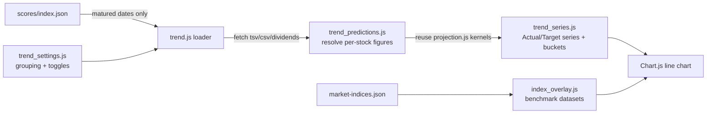

# Prediction Trend view: average Actual vs Target over time (Issue #430)

## Summary

Adds the **visible feature** of milestone #422: a new, purely additive
**Prediction Trend** view (`docs/trend.html` + `docs/trend.js`) that charts the
portfolio's **average Actual %** against its **average Target %** over the
matured-prediction history, so we can see whether predictions improve over time
(are we consistently over/under-predicting; do Actual and Target converge as
training progresses). The existing per-prediction dashboard (`docs/index.html`
chart + table) is left completely untouched — only an additive **Prediction
Trend** navigation link was added next to the Score File dropdown. Closes #430.

Key points:

- **Reuses the shared calculation — no second actuals maths.** A new headless
  resolver `docs/trend_predictions.js` parses each matured score date's files
  (score TSV, market CSV, dividend CSV) and resolves the per-stock
  `{ buyPrice, currentPrice, totalDividends, adjustedTarget }` inputs by
  delegating to the existing `GRQProjection` kernels (the same `getBuyPrice`,
  90-day-window current price, `sumDividends`/`filterDividendsWithin90Days` and
  `adjustHistoricalPriceToCurrent` the dashboard's Actual figure uses). Those
  inputs feed the already-merged data engine
  (`GRQTrendSeries.buildTrendData`, #429), so the Trend view's Actual/Target
  equal the dashboard's for the same date.
- **Grouping control** (`day` / `week` / `month` / `quarter`, default
  **month**) re-buckets the in-memory series with no re-fetch.
- **Benchmark overlays** (SP500 / NASDAQ / Russell 2000) reuse the headless
  overlay engine (`GRQIndexOverlay`, #431); grouping and toggles are remembered
  across visits via `GRQTrendSettings` (#432).
- **Empty / sparse-data state** handled: fewer than one matured bucket shows an
  informative message instead of an empty chart.
- **PWA wiring**: `trend.html`, `trend.js`, `trend_predictions.js`,
  `trend_series.js`, `index_overlay.js` and `trend_settings.js` are added to the
  `PRECACHE` list in `docs/sw.js`, and `APP_VERSION` is bumped
  `1.0.211 → 1.0.212` (aligned across `sw.js`, `sw-register.js`, `index.html`).
- **Accessibility**: `pa11yci.json` now also scans `trend.html` in light and
  dark themes (WCAG 2 AA), matching the rest of the site.

### Data flow

## Evidence

Trend view (default **month** grouping) — two lines, Actual (blue) vs Target
(gold):

Quarter grouping with SP500 + NASDAQ overlays enabled (settings restored from
localStorage):

Dark theme (axis text stays AA-legible):

Existing dashboard unchanged, with the additive **Prediction Trend** link:

Screenshots captured with headless Chrome against a local static server (the
Playwright MCP browser tools were unavailable in this environment).

### Deno regression avoided

This is a Deno repo; the feature is implemented as classic-`<script>` browser
modules plus Deno tests — no Node tooling, bundler or `package.json` introduced.

## Test Plan

- `tests/trend_predictions_test.ts` (new) — unit tests for the resolver:
  parsing the TSV/CSV/dividend files, resolving `buyPrice` / `currentPrice`
  (last point **within** the 90-day window) / `totalDividends` /
  `adjustedTarget`, the inclusion gate dropping a stock with no market data,
  and an end-to-end check that the resolved Actual/Target match the shared
  `GRQTrendSeries` kernels for a hand-computed fixture.
- `tests/trend_view_wiring_test.ts` (new) — guards the navigation in/out, the
  shared-module script order, the grouping control + canvas + empty-state
  markup, the service-worker precache list, and the `trend.html` ↔ `sw.js`
  version alignment.
- `tests/js_syntax_test.ts` — added syntax checks for `docs/trend.js` and
  `docs/trend_predictions.js`.
- Full suite: `deno test --allow-read tests/*.ts` → all green; `deno lint` /
  `deno check` clean; `cargo check --all-targets` clean (no Rust changed).
